# srw64-recomp

**Experimental native recompilation of Super Robot Wars 64.**

**《超级机器人大战64》原生重编译实验工程。**

[English](#english) · [简体中文](#简体中文) · [Preview / 画面](#development-preview) · [Technical docs / 技术文档](docs/README.md)

> Work in progress. This is a source and research repository, not a finished game
> release or a complete translation. Full-game compatibility has not
> been verified.
>
> 项目处于实验阶段。这是源码与研究仓库，尚非完整游戏发布版，也未完成全量翻译。
> 完整游戏兼容性仍待验证。

<a name="development-preview"></a>

## Development preview / 开发中画面

Actual native runtime captures. HD artwork is experimental and is not bundled;
Chinese and English dialogue are still drafts. Screenshots demonstrate the shown scenarios,
not full-game compatibility. [Media provenance](docs/media/manifest.json).

以下均为原生运行实拍。HD 美术仍属实验且不随仓库提供，中英文对白仍为草稿；
截图只展示对应场景的进展。来源与摘要见[媒体记录](docs/media/manifest.json)。

**Three-language and reading controls demo / 三语与阅读操作演示（95 秒）**

https://github.com/user-attachments/assets/0f1d7f87-661b-426c-b8e8-cd6cf6ae21f2

[Download MP4 / 下载 MP4（约 8.8 MB）](docs/media/reading-demo.mp4)

Japanese → Chinese → English → Original / HD → dialogue history → auto reading →
fast-forward → skip → manual dialogue. This continuous, silent recording preserves
the captured speed and includes the final manual-dialogue stop. / 日文 → 中文 → 英文 →
原始／HD → 多条回看 → 自动阅读 → 快进 → 跳过 → 手动对白。视频连续实录、静音、原速，包含跳过后的手动停点。

<details open>
<summary><strong>English dialogue, history and name entry · 英文对白、回看与姓名页</strong></summary>

English covers the same draft text as Chinese. Long dialogue is paginated; the
history capture follows twelve normally completed fragments. **F7** also changes
the native name editor without replacing entered names. Original character names
remain Japanese. / 英文覆盖现有中文草稿范围；长对白分页显示，回看截图来自正常读完
12 个片段后的历史。**F7** 同样支持原生姓名页，切换时保留已输入字段；原始角色姓名保持日文。

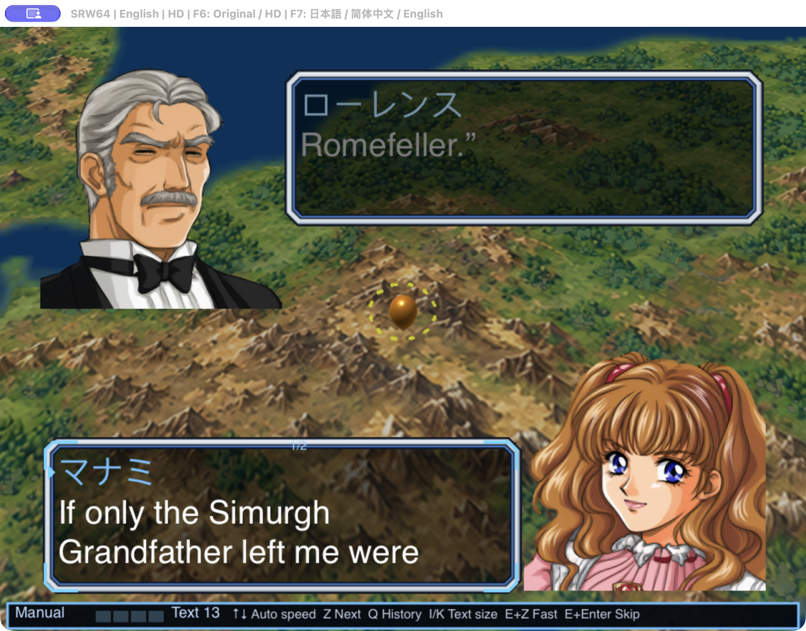

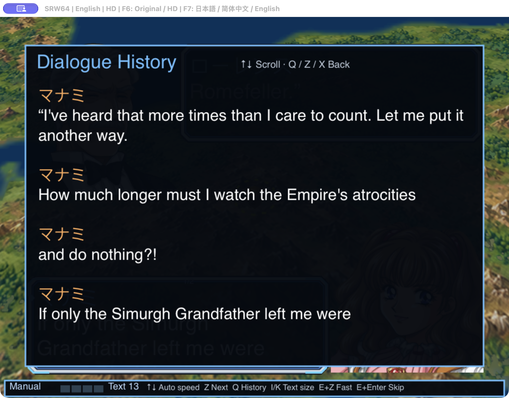

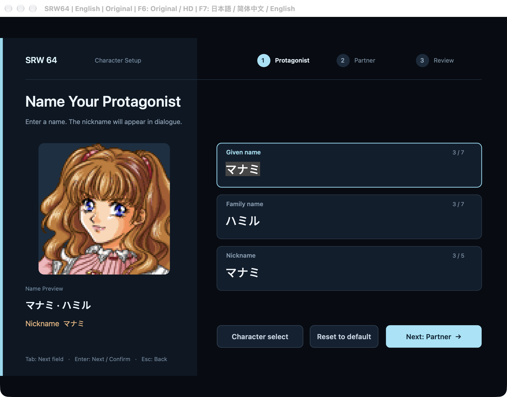

</details>

<details>
<summary><strong>Original / HD · 原始与高清画面对照</strong></summary>

The same dialogue in one run; **F6** switches artwork and the world-map marker,
independently of language and text size. / 同次运行、同一段对白；**F6** 切换美术与世界地图标记，语言和字号独立。

| Original / 原始画面 | Experimental HD / 实验性高清 |
| --- | --- |
| 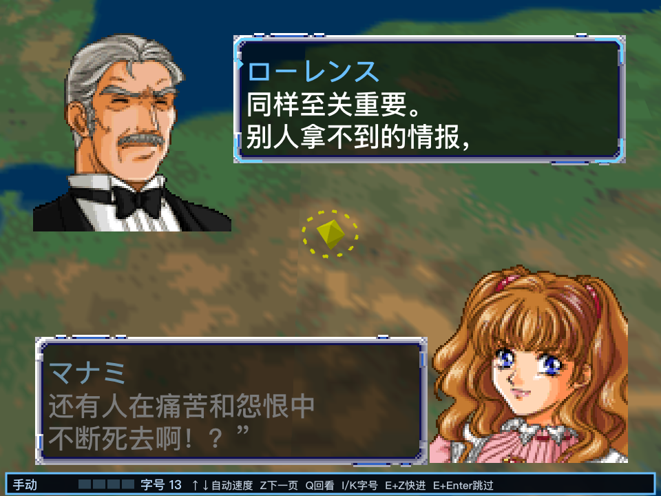 | 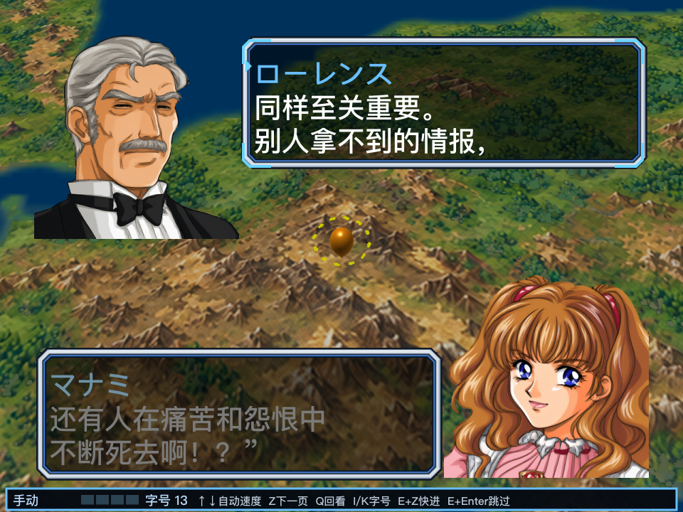 |

</details>

<details>
<summary><strong>Native name entry and stage 1 · 原生姓名页与第一话地图</strong></summary>

| Native name entry / 原生姓名页 | Stage 1 map / 第一话地图 |
| --- | --- |
| 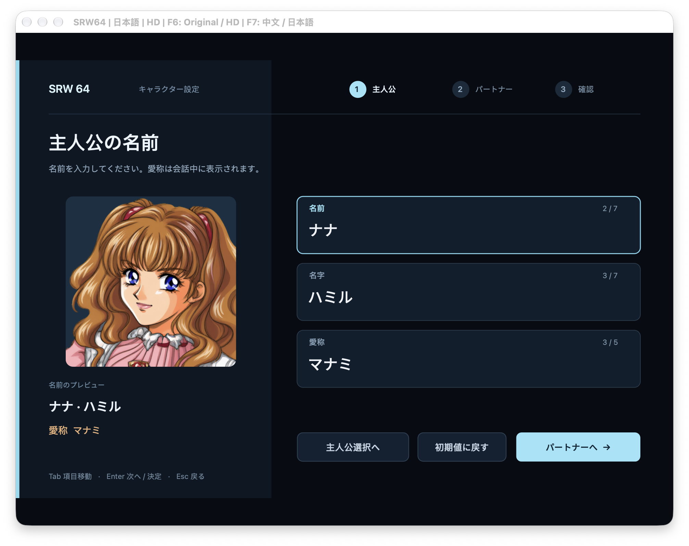 | 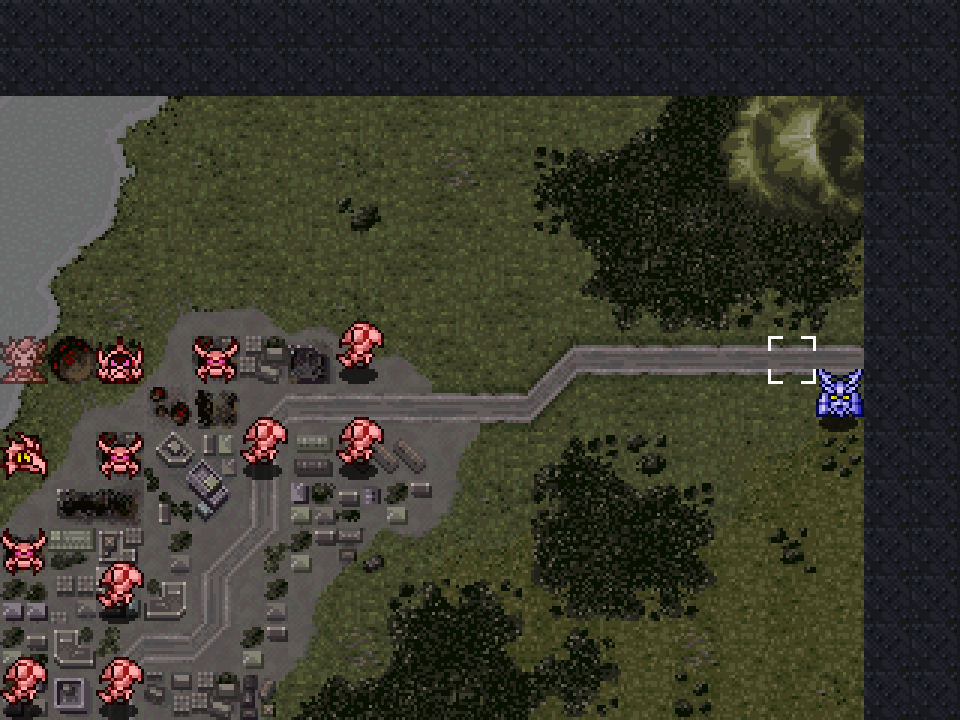 |

The name editor preserves the test input **ナナ** across language changes. The map
capture comes from an isolated SRAM cold-load experiment; complete-state autosave
is not yet available. / 姓名页切换语言后保留测试输入 **ナナ**。地图截图来自独立 SRAM
冷启动实验，完整状态自动保存尚未开放。

</details>

<details open>
<summary><strong>Japanese / Chinese history comparison · 中日文回看对照</strong></summary>

Twelve dialogue fragments were read through normal confirmation before opening
history. **F7** retranslates the same history without a dialog or restart. /
先通过正常确认读完 12 个对白片段，再打开回看；**F7** 切换同一组历史的语言，无弹窗、不重启。

These captures show the earlier Japanese / Chinese demo. The current build also
includes an English draft and cycles **Japanese → Chinese → English** with F7. /
这些截图来自此前的中日文演示；当前版本已加入英文草稿，F7 按**日文 → 中文 → 英文**循环。

| Chinese / 中文 | Japanese / 日文 |
| --- | --- |
| 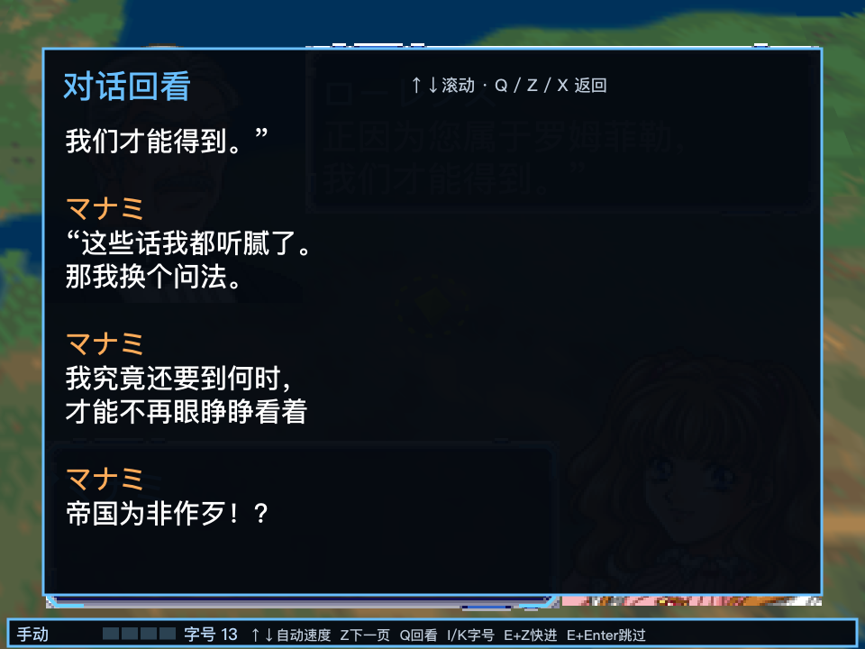 | 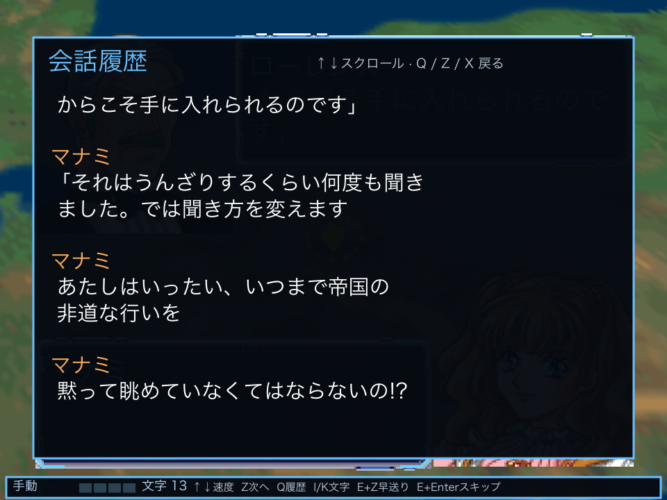 |

</details>

<details open>
<summary><strong>Auto reading, fast-forward and skip · 自动对话、快进与跳过</strong></summary>

| Auto reading / 自动对话 | Hold to fast-forward / 按住快进 |
| --- | --- |
| 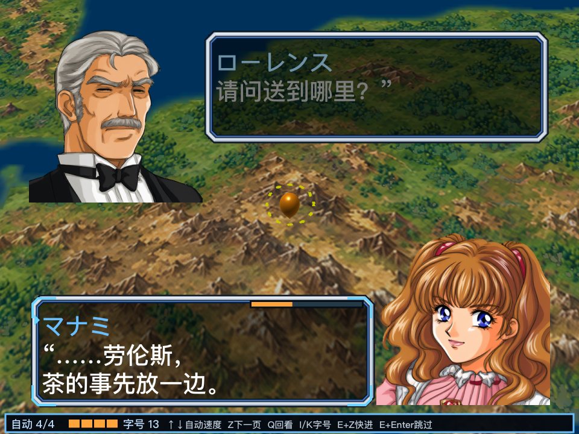 | 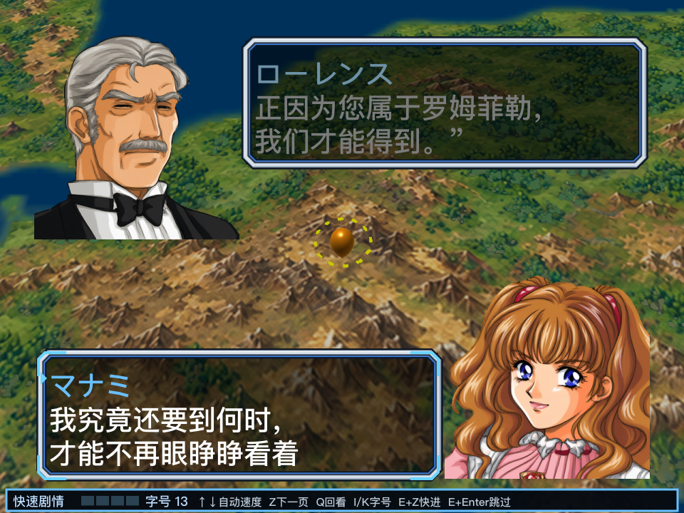 |

**↑ / ↓** changes the auto-reading speed; **X** returns to manual reading.
Hold **E + Z** to fast-forward; release to stop the temporary acceleration. /
**↑ / ↓** 调节自动阅读速度，**X** 恢复手动；按住 **E＋Z** 快进，松开结束临时加速。

| Before skip / 跳过前 | Skipping / 跳过执行中 | Manual stop / 恢复手动 |
| --- | --- | --- |
| 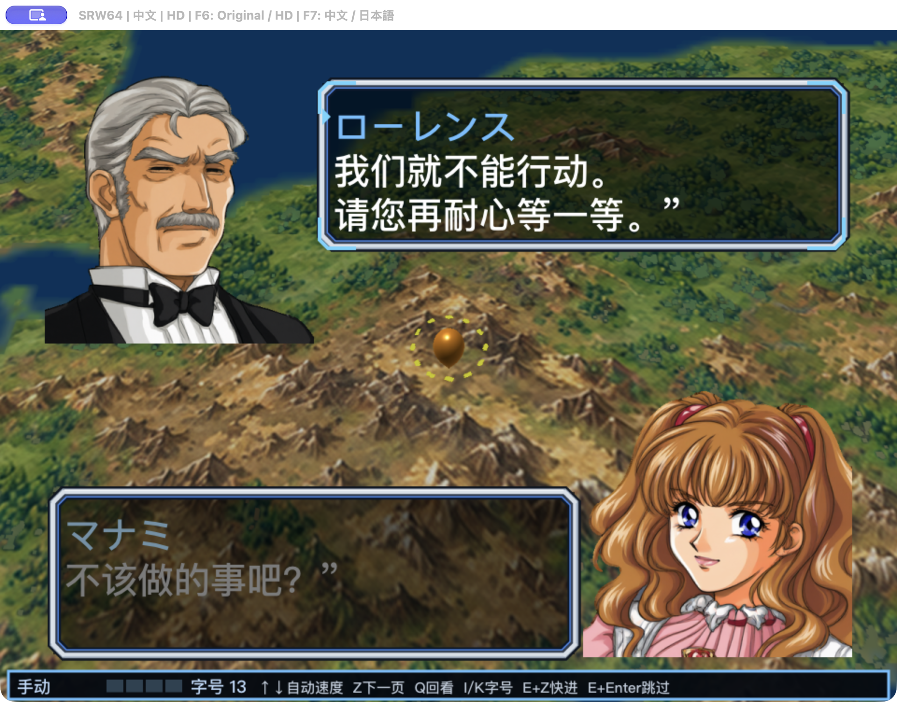 | 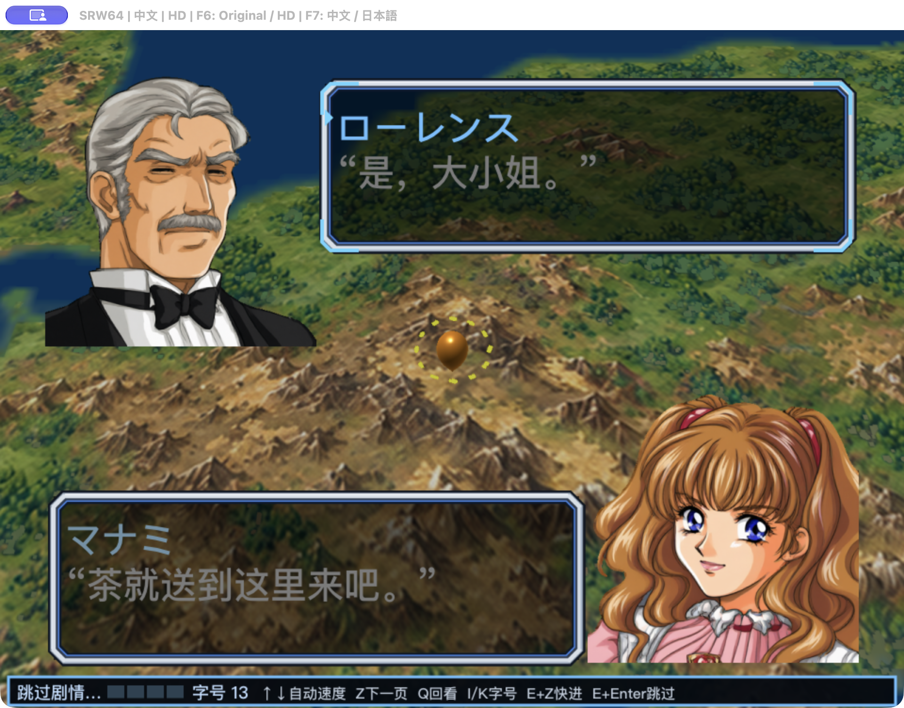 | 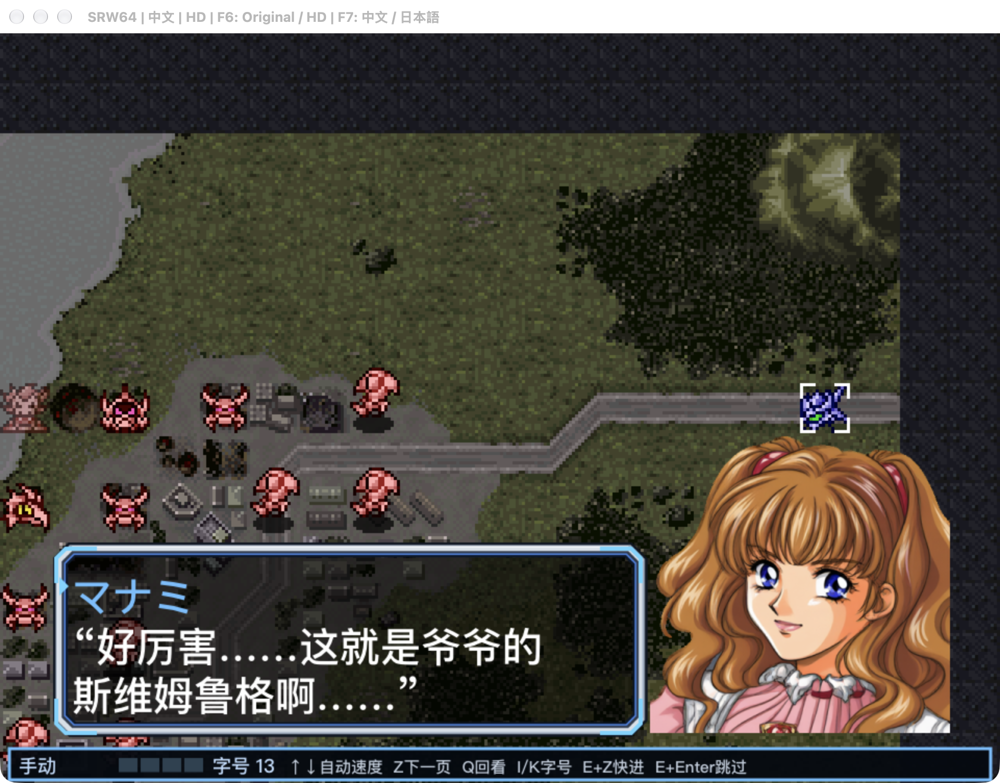 |

**E + Enter** skips the current dialogue script while its events and scene
transitions continue. This run reaches the stage 1 battlefield and stops at a
new manual dialogue. Skipping only previously read dialogue is **not implemented yet**; original
random timing is preserved. / **E＋Enter** 跳过当前对话脚本，事件与场景过渡继续执行。
本次运行进入第一话战场后停在新的手动对白。**仅跳过已读的策略尚未实现**，原版随机时序保持不变。

</details>

## English

This project uses **N64Recomp**, **N64ModernRuntime**, and **RT64** to run
recompiled code from the Japanese Rev 0 release of Super Robot Wars 64. The
original game scripts drive progression; native modules provide text rendering,
reading controls, presentation options, and development diagnostics.

Features are organized as **internal modules**. External MOD loading, a public
plugin API, and a general-purpose editor are outside the current scope.

### What works today

| Area | Current implementation |
| --- | --- |
| Languages | **F7** cycles Japanese → Chinese → English immediately, without a dialog or restart, and remembers the selection. Standard dialogue and the new native UI are integrated; missing translations fall back to Japanese. |
| Presentation | **F6** switches Original / HD independently of language and text size. HD uses optional local experimental artwork and a native replacement for the world-map marker. |
| Dialogue | Unicode text, pagination, adjustable text size, four auto-reading speeds, fast-forward, and dialogue history. Switching language restarts the current text fragment without advancing the script. |
| Name entry | An in-window native editor with original character and length validation. Language changes preserve edited fields and respect active IME composition. |
| Gameplay | Optional rule corrections for original defects (ESP / Aura Warrior levels, the Limit cap, Potential bands, missing weapon-upgrade carry-over, Hyper Aura power), on by default, plus off-by-default difficulty options (fewer boss dummies, upgrade cap break). An always-on fix stops a hostile Wufei from gaining one dummy per kill. An optional rules file changes upgrade increments, prices and caps. The **Options** menu and settings window switch rules, language and images live. See [rule fixes](docs/gameplay/rule-fixes.md) and [upgrade limits](docs/gameplay/upgrade-limits.md). |
| Saves | Isolated SRAM session history, integrity checks, and explicit recovery. A first-stage clear save has been cold-loaded into intermission. Full-state safe-node autosave remains a prototype. |
| Developer tools | ROM identity checks, resource and script extraction, data/story/model viewers, native probes, and state comparisons. |

**Translation coverage:** Chinese and English each cover the same 153 draft
records out of 51,174 extracted text records, plus all 40 native UI labels.
No text records are marked reviewed yet. This count is an extraction denominator, not a
claim that every menu or text renderer supports language switching. Original
menus, battle labels, and baked-in text still have integration work remaining.

### Getting started

The repository does **not** include a ROM, game saves, extracted game assets,
fonts, HD texture packs, generated game code, or a prebuilt application. Supply
your own matching original Japanese Rev 0 ROM as `rom.z64` in the repository
root. Its identity and pinned toolchain sources are in [provenance](docs/guide/provenance.md).

Python **3.11+** is required, along with a C/C++ toolchain, CMake, Ninja, and SDL2
for the native host. The build instructions below are currently validated on
macOS / Apple Silicon with the Metal backend. Dependencies are pinned in
`config/recomp/toolchain.json`; setup downloads and builds them locally.

```sh
# ROM-independent Python checks.
make bootstrap
make check

# Prepare the pinned native toolchain and generate game code.
# These steps require the local ROM and native build prerequisites.
make recomp-bootstrap
make recomp-layout
make recomp-scan
make recomp-cpu
.venv/bin/python tools/recomp/toolchain/prepare_rt64.py

# Start a new game using original artwork; no local HD pack or saved game needed.
.venv/bin/python tools/recomp/run/play_native.py \
  --profile config/recomp/profiles/play-profile.json \
  --language ja --images original --new-game --mute
```

Use `--language zh-Hans` for the Chinese draft, `--language en` for the English
draft, or press **F7** in game to cycle languages. On
keyboards with media keys, the function-key modifier may be needed. The checked-in
profile starts with original artwork, so a fresh checkout runs without any local
assets; **F6** switches to HD only when the matching experimental art is installed
under `assets/` (not published), and `--images hd` starts in HD. The `.command` launchers in `scripts/` are local
development conveniences; use the explicit command above for a first launch.

After the native build has been configured, `make recomp-native-check` runs the
C++ component checks. These are separate from Python CI and from actual gameplay
validation. The [development guide](docs/guide/native-development.md) has detailed
build steps and module boundaries; most technical notes are currently Chinese.

### Experimental limits

- Runtime evidence covers the female super-robot route through stage 1 and a
  cold reload into intermission, plus targeted dialogue, name-entry, and graphics
  checks. Later stages and other routes are not fully validated.
- The original per-frame random timing is preserved. Dialogue skip comparisons
  reproduce timing differences; battle-animation skip equivalence is unverified.
- Original SRAM recovery does not restore the entire random state. Full-state
  autosave, reliable turn rollback, and arbitrary save states are not available.
- HD artwork is experimental and remains local. Screenshots showing it do not
  imply the assets are bundled or that all scenes have HD replacements.
- Windows / Linux native backends, complete translation, and the broader QoL
  roadmap remain future work. See the [internal MOD roadmap](docs/design/mod-roadmap.md)
  and [foundation verification](docs/native/native-foundations-verification.md).

## 简体中文

本项目基于 **N64Recomp、N64ModernRuntime 和 RT64**，重编译并运行
《超级机器人大战64》日版 Rev 0 的原始代码。原游戏脚本负责剧情和进度推进，
原生模块提供文字显示、阅读控制、画面选项与诊断工具。

功能按**项目内部模块**组织；目前不接入外部 MOD，不提供公开插件 API 或完整编辑器。

### 当前功能

| 模块 | 已实现范围 |
| --- | --- |
| 语言 | **F7** 按日文 → 中文 → 英文循环热切换，无弹窗、不重启，并记住选择。标准对白和新增原生 UI 已接入，缺译回退日文。 |
| 画面 | **F6** 独立切换 Original／HD，语言和字号不随之改变。HD 使用本地实验素材，并替换世界地图标记模型。 |
| 阅读 | Unicode 文字、分页、字号调节、四档自动阅读、快进和对话回看。切换语言从当前文字片段开头重新显示，不推进脚本。 |
| 姓名输入 | 游戏窗口内的原生编辑页面，遵守原字库和字数限制；语言切换保留已编辑字段，不打断输入法组字。 |
| 玩法 | 可选规则修正（超能力／圣战士按等级、限界封顶、底力档位、换机漏继承的武器改造、ハイパーオーラ威力）默认开启，难度调整（头目假身减半或取消、改造上限突破）默认关闭；默认生效的基础修复避免敌方五飞按击坠数获得假身；可选的规则文件修改改造增量、价格与上限。菜单栏「选项」与设置窗口可随时切换规则、语言和画面。见[可选规则修正](docs/gameplay/rule-fixes.md)、[改造段数与上限](docs/gameplay/upgrade-limits.md)。 |
| 存档 | 隔离的 SRAM 会话历史、完整性检查和显式恢复；第一话通关档已冷启动恢复到整备。完整状态的安全节点自动保存仍是原型。 |
| 开发工具 | ROM 身份校验、资源与脚本提取、数据／剧情／模型查看器、原生运行探针和状态比较。 |

**翻译覆盖：** 已提取的 51,174 条文本记录中，中英文各覆盖相同的 153 条草稿，
另有全部 40 条原生 UI 文案；文本记录的已审校数量均为 0。
该数字是提取记录的覆盖统计，不代表全游戏所有显示位置已经支持语言切换；原版菜单、
战斗标签和图片内嵌文字仍有待接入。全量翻译另行排期。

### 启动与检查

仓库不包含 ROM、存档、提取后的游戏素材、字体、HD 纹理包、生成的游戏代码或预编译程序。
请自行准备匹配的日版 Rev 0 原始 ROM，放在仓库根目录并命名为 `rom.z64`。
ROM 身份和工具链固定版本见[来源记录](docs/guide/provenance.md)。

需要 **Python 3.11+**；原生宿主还需要 C/C++ 工具链、CMake、Ninja 和 SDL2。
以下构建流程目前在 macOS / Apple Silicon 的 Metal 后端上完成验证。
按上方英文部分的命令依次准备 Python 环境、原生依赖和生成代码，
再以 `--images original --new-game --mute` 首次启动，可避免依赖本地 HD 素材和历史存档。
原生依赖会下载并构建到本地 `build/`。

将启动参数改为 `--language zh-Hans` 使用中文草稿、`--language en` 使用英文草稿，
或在游戏中按 **F7** 循环切换三种语言。
媒体键键盘可能需要同时按功能键修饰键。已提交的 profile 默认使用原始美术，新克隆无需任何本地素材即可运行；
只有在 `assets/` 下装有对应的实验 HD 素材（不公开发布）时才可用 **F6** 切到高清，`--images hd` 则以高清启动。
`scripts/` 里的 `.command` 文件是本地开发快捷入口，首次启动请使用上面的完整命令。

`make check` 不需要 ROM；完成原生构建配置后，`make recomp-native-check` 运行 C++ 组件检查。
Python CI、原生组件测试与真实游戏流程验证分别记录。构建细节、静音测试和模块责任见
[原生开发指南](docs/guide/native-development.md)。

### 实验阶段的边界

- 原生运行证据覆盖女性超级系第一话通关、通关档冷启动到整备，以及针对对白、姓名页和
  图形切换的检查；尚未完成其他路线、后续关卡和全游戏验收。
- 保留原版每帧随机时序。对白跳过对照已复现时序差异，战斗动画跳过的等价性仍未验证。
- 原版 SRAM 不完整恢复随机状态。完整状态自动保存、可靠的回合回退和任意时刻即时存档尚不可用。
- HD 美术属于本地实验，展示截图不意味着仓库附带素材，也不意味着全部场景已高清化。
- Windows／Linux 原生后端、完整翻译和更多 QoL 功能仍在规划中。见
  [内置 MOD 路线图](docs/design/mod-roadmap.md)和[底座验证记录](docs/native/native-foundations-verification.md)。

## Source layout / 源码目录

| Path | Responsibility / 职责 |
| --- | --- |
| `src/srw64_rom/` | ROM identity, formats, codecs / ROM 身份、格式与编解码 |
| `src/srw64_native/` | Content/profile compilation and save tooling / 内容编译与存档工具 |
| `src/native/` | Localization, game adapters, presentation / 本地化、游戏适配与呈现 |
| `src/host/` | Native game host (macOS AppKit parts in `macos/`) / 原生游戏宿主（AppKit 部分在 `macos/`） |
| `tools/recomp/` | Toolchain, launch, verification, script lab, probes and analysis tools, one subfolder each / 工具链、启动、验证、脚本实验、探针与分析，按用途分子目录 |
| `config/recomp/` | Pinned toolchain config, play `profiles/`, bounded-run `inputs/`, `mini-stages/` / 固定工具链配置、试玩档案、有界运行输入与迷你关卡 |
| `scripts/` | macOS double-click launchers / macOS 双击启动脚本 |
| `content/` | Language catalogs and art manifests / 语言目录与美术清单 |
| `tools/content/`, `tools/data_viewer/`, `tools/model_viewer/` | Extraction and inspection / 数据提取与查看 |
| `tools/hd_ai/` | Experimental HD-art processing / 实验性 HD 美术处理 |
| `tests/` | Python and native component checks / Python 与原生组件检查 |
| `docs/`, `reference/` | Engineering notes and source references / 工程记录与来源参考 |

## Credits and contributing / 致谢与贡献

Built on [N64Recomp](https://github.com/N64Recomp/N64Recomp),
[N64ModernRuntime](https://github.com/N64Recomp/N64ModernRuntime), and
[RT64](https://github.com/rt64/rt64). Additional sources and pinned revisions are
listed in [provenance](docs/guide/provenance.md). This is an unofficial project; game
content belongs to its respective rights holders. A license for the project's
own source has not yet been selected; third-party components retain their own terms.

感谢上述项目及[来源记录](docs/guide/provenance.md)中的工具与参考资料。本项目为非官方工程，
游戏内容的权利归各自权利人所有。项目自有源码许可证尚未选定，第三方组件遵守各自条款。

See [CONTRIBUTING.md](CONTRIBUTING.md) for repository boundaries and validation
requirements. Historical links into `build/` refer to local evidence, not files
included in this repository. Exported data and HD art live in the untracked
`assets/` directory ([guide](assets/README.md)).

贡献约定与验证要求见 [CONTRIBUTING.md](CONTRIBUTING.md)。历史文档中的 `build/` 链接指向本地
证据文件，不随源码仓库分发。导出的数据与 HD 素材放在不入库的 `assets/`（[说明](assets/README.md)）。
