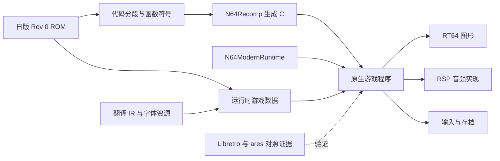

# SRW64 静态重编译方案

建议采用 **N64Recomp + N64ModernRuntime + RT64**，先完成日版原生可玩纵向样片，
再接入原生语言目录和美术资产。第一轮投入用于确认代码布局、系统调用和 RSP 微码；
首个产品门槛是“新游戏 → 第一场完整战斗 → 过关整备 → 存档 → 退出后读档”。

本方案按 macOS arm64 为首个开发与验收平台规划，之后扩展 Windows/Linux。
这是实施顺序建议。日期：2026-09-08；仓库检查基点：
`bc93a869e99fcafaf2c836751a6d46ee9c7a14dc`。
当前已进入实施，完成函数级原生解压与音频任务对照；完整游戏的生成、链接与
原生场景仍未通过。实测进度以 [recomp-progress.md](recomp-progress.md) 为准。
下表保留规划时的起点；已变化的项目由进度文档明确更新。

**现有基础与本次实查**

| 项目 | 当前证据 | 对 recomp 的作用 |
| --- | --- | --- |
| 日版基线 | 本次重算 SHA-256 匹配 `config/srw64-jp-rev0.json`；32 MiB、NS4J、Rev 0 | 全部映射与符号绑定到同一个输入 |
| ROM 入口字段 | ROM 头 `0x08` 读出 `0x80076610` | 启动分析的线索；实际加载范围和初始化条件仍需追踪 |
| 图形微码线索 | ROM `0x00059BD8` 有 `RSP Gfx ucode F3DEX       fifo 2.08` 标识 | 优先验证 RT64 的对应处理路径；字符串不等于兼容性验收 |
| 文本与资源 | 20 张表、51,174 条记录；已有 LZ 资源编解码和无损 IR | 支持诊断、中文资源导入及回归对照 |
| 模拟器对照 | 已有 Libretro 路线、截图及 ares 调试探针；本次复核报告和核心哈希 | 用作原生版本的行为 oracle；本次没有重新运行游戏 |
| 存档线索 | 本地 `rom.ram` 为 32 KiB；已有文档记录 `SRW64V3`，ROM 也能找到该标识 | SRAM 为待确认假设；文件大小不能单独证明存档 API、布局或导入格式 |
| 当前缺口 | 仓库尚无 recomp 配置、CPU 符号、代码段/overlay 清单 | 关键路径从逆向元数据开始 |

日版 ROM SHA-256：
`ee5f4a21d8e5f7827d21199e27800edf250df9a8e4d10befb1a6992df597b13e`。
原始 ROM、字形映射与工具链身份见[来源记录](../guide/provenance.md)。

**技术路线与边界**

N64Recomp 将已识别的 MIPS 函数转成 C；游戏逻辑仍遵循原始内存和执行语义。
N64ModernRuntime 提供 libultra 系统能力及重编译代码桥接；图形交给 RT64，
音频微码另行识别和接入。这里的原生化仍包含 N64 硬件行为的兼容实现。
[N64Recomp](https://github.com/N64Recomp/N64Recomp)、
[N64ModernRuntime](https://github.com/N64Recomp/N64ModernRuntime)。



选择这条路线的原因是能够逐步恢复必要的函数、分段和系统边界。完整 matching
decomp 可以作为长期研究积累；首个样片只要求目标路径及其依赖闭合。
自写游戏引擎会增加战斗、AI、事件脚本和存档语义的重实现成本，暂不进入首期范围。

元数据可以直接走 `ROM + symbols TOML`。本次检查的 N64Recomp
`src/config.cpp` 已解析 `symbols_file_path`、section 的 `rom/vram/size`，
以及函数的 `name/vram/size`。其 README 中“仅支持 ELF”的描述落后于代码，
实施以固定提交的实际解析器为准。
[配置解析源码](https://github.com/N64Recomp/N64Recomp/blob/ffb39cdad1da5de07eaaa48bd1db4a89a7986771/src/config.cpp)。

分段工具候选为 [splat](https://github.com/ethteck/splat)，MIPS 分析候选为
[spimdisasm](https://github.com/Decompollaborate/spimdisasm)。先生成函数候选，
再通过控制流、引用和运行时轨迹修订。可维护的反汇编/ELF 链路用于验证和 patch
符号导出，但不必先完成全部 C 源码恢复。自动识别结果不直接视为最终函数边界。

**R0：可行性勘测，建议预算 3–5 个工作日**

目标是产出可复核的判断，以及下一阶段所需的最小映射。

1. 从入口跟踪启动复制、BSS 清零、栈和初始线程，建立 ROM 文件偏移与 RDRAM
   地址的分段对应。记录入口字段与实际首个游戏函数的关系，禁止给全 ROM
   套用同一个固定偏移。
2. 从启动到标题、选主角、进入地图和战斗，各记录 PI DMA、解压目标、代码装载
   与执行地址。区分常驻代码、覆盖装载代码和普通资源。当前不能假设不存在
   overlay、压缩代码、TLB 映射或自修改代码。
3. 识别启动/线程/消息队列/计时/控制器/PI/SI/SP/VI/AI/存档相关函数，建立
   “ROM 函数 → runtime 实现或待实现适配”的表。库函数签名须由反汇编、参数
   和调用点交叉确认。
4. 在任务提交边界采样 `OSTask` 的类型、微码代码/数据地址与大小、内容哈希、
   命令缓冲和触发场景。分别调查标题、地图、全战斗动画及音频任务，确认
   `F3DEX fifo 2.08` 是否为实际运行版本，以及是否还存在其他微码。
5. 在 macOS arm64 构建一套固定版本的 runtime/renderer 最小宿主，验证窗口、
   图形初始化和音频输出回调。此项只证明宿主集成；需另以 SRW64 任务样本判断
   渲染与音频兼容性。

R0 产物建议为 `segments.json`、`functions.csv`、`os-bindings.csv`、
`rsp-tasks.json`、`risks.md`。JSON 使用版本化 `schema`；每条判断附带
`candidate/static-verified/runtime-observed` 状态和证据路径。

通过门槛：解释清楚启动路径与已覆盖场景的代码来源，列出系统适配缺口，
并给出图形、音频微码各自的实现路径。若发现依赖大规模自修改代码、复杂微码
overlay 或尚无可行处理路径的硬件行为，先对该项做专项验证并重估工期。
3–5 日是决策预算，不保证所有未知项在这一轮消除。

**R1：CPU 重编译与系统接入，建议预算 1–3 周**

以 R0 映射为输入，维护 section、函数入口与大小、跳转表和数据引用。为每个
代码段保留源字节哈希；若有压缩代码，记录原始 ROM 范围、解码算法、解码后
映像偏移和运行地址。重编译使用的展开映像与运行时原始 ROM 地址必须显式关联。

生成器提前拒绝越界、意外重叠、零长度函数及未解释的直接跳转；单独登记允许的
别名、尾调用和跳转表。静态调用闭包与动态调用轨迹共同补齐间接调用。
overlay 按装载/卸载更新函数查找表，同一地址对应不同代码的情况不能只按地址缓存。

接入 libultra 替代实现，处理内存字节序、32 位地址、MIPS 64 位寄存器语义、
FPU 模式及启动状态。直接 MMIO、轮询、CP0、异常和 cache/TLB 路径逐项审查。
未解析的调用或未接入的必要系统行为必须显式报错，不能用统一空实现把流程推进。

通过门槛：生成 C 和宿主编译通过；SRW64 原生线程能从冷启动推进到首批稳定的
VI/图形/音频任务提交，输入和消息队列有可核验的活动。此阶段可以没有完整画面，
但报告必须区分“生成成功”“编译成功”和“原生 CPU 路径运行成功”。

**R2：日版画面、音频与输入，建议预算 1–3 周**

将实际图形任务接入 RT64，优先保持原始画幅、渲染节奏及纹理过滤行为。
RT64 当前提供 Metal、Vulkan 和 D3D12 后端，macOS 首选 Metal；SRW64 的
正确性需要单独验收。[RT64 能力与架构](https://github.com/rt64/rt64/blob/43373749dac9bbc1b653e6a02aed40a9e1783bed/README.md)。

重点核验 I4 字库、透明度、纹理矩形、裁剪、菜单高亮、战斗背景、特效及帧缓冲
读回。若 HLE 无法处理实际微码，评估 RSP 重编译配合低层 RDP 路径的专项原型；
这需要额外集成，不能视为已有的一键回退。优先在游戏适配层解释差异。

音频先识别微码，再选择已有的兼容实现或 RSPRecomp。对已捕获任务比较输出
缓冲、任务完成语义和采样率，之后验收菜单音效、BGM、战斗音效以及实际出现的
语音样本。RSPRecomp 的微码 overlay 能力需针对固定版本核验，不能把图形支持
推导为音频也支持。
[RSPRecomp 源码](https://github.com/N64Recomp/N64Recomp/tree/ffb39cdad1da5de07eaaa48bd1db4a89a7986771/RSPRecomp)。

通过门槛：冷启动、标题、选主角、名字确认、目标剧情和首张战术地图可操作，
画面与声音经对照验收，流程中没有未解释的调用或任务。原始 VI 频率、逻辑更新
频率、有效画面更新频率分别测量；Libretro 报告的 60 Hz 不等于游戏原生 60 FPS。

**R3：日版可玩闭环，建议预算 1–2 周**

首条主路线沿用已有女性超级系路线，以缩短对照场景准备时间，并将其延伸到
移动、攻击、完整战斗动画、敌方回合、过关和整备。原版是否支持动画跳过尚未
通过一手资料或运行时入口确认，不作为当前原版闭环的必测项；原生新增跳过功能
留作后续增强。其他主角先做
开局覆盖，后续再扩展各自分支。

确认存档硬件调用、校验与容器格式后，加入独立存档目录和原子写入。以副本
测试空白存档、保存、关闭进程、重启读档和覆盖保存。模拟器即时状态只能用于
参考端取证，不能直接作为原生程序的存档或冷启动替代。

通过门槛：至少一条路线完成“新游戏 → 一场完整战斗 → 过关整备 → 保存 →
退出进程 → 重新启动并读档继续”，且关键状态与参考端一致。出现 native save
成功前，不把标题可运行称为可玩版本。

**R4：原生语言与内容**

2026-09-12 更新：语言统一由 `content/locales/` 的 Unicode 目录提供。
原始日文 ROM、完整 TextKey、原文摘要和脚本屏障保持固定，原生字体负责换行、
分页与阅读呈现。旧补丁 ROM 和字形分配流程已移除。

现在数据文本由词条表、剧情与战斗台词由台词文本文件提供中英文译文，详见[内容架构](../native/native-content-foundation.md)。
全量翻译、其他菜单消费者、名字本地化与各路线存读档仍须逐项验证；
不能以目录可解析代替目标画面验收。

**R5：覆盖扩展与发行准备，按新增风险滚动估算**

覆盖四位主角、代表性路线分支、后期地图与事件、不同战斗/武器/特效、整备菜单、
游戏结束和结局。建立“内容场景 × 系统能力”的覆盖表；函数命中率用于定位空白，
不能替代路线验收。跨平台构建通过后仍需各平台运行检查。

Link Battler / Transfer Pak 单列兼容性任务，首先明确无设备时的原始行为，
后续再实现设备协议与数据交换；直接修改联动解锁标志应作为另一项可选功能，
不能算作联动兼容。首个样片不以该功能为前置条件。

体验改进建议顺序：稳定存档与按键设置 → 读屏与文字体验 → 高分辨率 → 宽屏 →
高刷新率。宽屏需处理 2D UI、战斗背景与裁剪；高刷新率需区分插帧和逻辑更新。
均在原始行为基线通过后按场景加入。

**回归证据设计**

| 层级 | 通过意味着什么 | 不足以证明什么 |
| --- | --- | --- |
| 静态 | 身份、映射、符号、资源和生成结果满足检查 | 游戏能运行 |
| 编译 | 生成代码和宿主能够链接 | 启动、画面或系统行为正确 |
| 原生启动 | 新进程进入目标初始化/任务边界 | 战术和战斗路径可玩 |
| 原生场景 | 指定 ROM/程序/输入下完成明确场景 | 全路线覆盖 |
| 原生闭环 | 战斗、过关和进程重启后的存读档成立 | 全量内容与联动兼容 |

参考端复用 `tools/recomp/probes/libretro_runner.py` 的输入数据和场景意图；原生端需要新的
输入回放、状态观测、截图及日志适配器，Libretro 帧号不能直接当成原生渲染帧号。
先按 VI/控制器采样或场景条件同步，再细化确定性回放。统一输入语义后比较菜单
位置、文本 key、回合、单位 HP/EN、资金与存档字段；随机种子/状态能被固定时
再做精确战斗结果比较，不能把随机差异直接判为回归。

视觉比较对齐尺寸、画幅和内容，登记过滤、抖动等可解释的渲染差异，同时人工
审阅关键画面；不要求不同渲染器的 PNG 哈希相同。音频分别检查任务输出、
持续播放和实际听感。现有软件参考配置为 Angrylion RDP + CXD4 RSP。

每份原生报告应记录基础 ROM/实际数据映像、二进制、符号、依赖、配置、输入和
存档种子的哈希，以及平台、场景、逻辑观测、截图/音频证据与通过边界。代码、
系统绑定和美化 patch 分开登记，避免无法归因的混合修改。

**建议目录与提交边界**

初期继续放在当前仓库，以便共同使用 ROM 身份门禁和中文 IR。以下是待创建的
目录设计；本次只添加规划文档。

```text
config/recomp/                 分段、生成配置、系统绑定、依赖版本
symbols/                       审阅后的 section/function/data 元数据
tools/recomp/                  提取、符号导出、校验与回放工具
native/                        CMake、宿主入口、输入/存档/任务适配
native/patches/                有证据与回归用例的游戏适配和后续改进
tests/recomp/                  合成输入测试与元数据约束
docs/recomp/                   决策、风险、场景矩阵和验收记录
build/recomp/                  忽略：ROM 派生代码、映像、任务、二进制和截图
```

继续遵守 [贡献规范](../../CONTRIBUTING.md)：原始/修改 ROM、提取资产、RAM、
存档、字体及生成代码保留在本地输出目录；源码提交由配置、工具、符号、手写
适配、测试和文档组成。公开 CI 使用合成输入检查配置和宿主；真实 ROM 的生成与
运行验收在本地执行。第一轮按“勘测工具与记录 → 符号生成 → 系统适配 → 图形/
音频 → 可玩回归 → 中文接入”分别提交。

依赖在能共同构建的版本组合上锁定，保存递归 submodule 版本和许可证清单。
N64ModernRuntime 当前标明 GPL-3.0，宿主集成与源码发行安排需按所选依赖处理；
N64Recomp 和 RT64 当前标明 MIT。已公开项目的宿主代码只作为有来源的参考。

**上游检查快照与工期使用方式**

以下是 2026-09-08 查询到的上游分支快照，供复核源码，尚未验证为可共同构建的
SRW64 工具链组合：

| 上游 | 检查提交 |
| --- | --- |
| [N64Recomp](https://github.com/N64Recomp/N64Recomp/commit/ffb39cdad1da5de07eaaa48bd1db4a89a7986771) | `ffb39cdad1da5de07eaaa48bd1db4a89a7986771` |
| [N64ModernRuntime](https://github.com/N64Recomp/N64ModernRuntime/commit/cdf5abbd5026fef5c364c676e4667c45e42b6863) | `cdf5abbd5026fef5c364c676e4667c45e42b6863` |
| [RT64](https://github.com/rt64/rt64/commit/43373749dac9bbc1b653e6a02aed40a9e1783bed) | `43373749dac9bbc1b653e6a02aed40a9e1783bed` |
| [Zelda64Recomp 宿主参考](https://github.com/Zelda64Recomp/Zelda64Recomp/commit/1a9c26613c6e0906140dc8bcca7362cbe00bf1eb) | `1a9c26613c6e0906140dc8bcca7362cbe00bf1eb` |

此 N64ModernRuntime 快照内嵌的 N64Recomp 为
`81213c1831fab2521a6a5459c67b63437d67e253`，与上表独立上游最新提交不同。
应先验证 runtime 配套版本；如需更高版本的功能，再以明确的生成/链接/运行
回归升级。Zelda 的符号与游戏 patch 不可直接用于 SRW64。

单人全职、主要系统边界可直接适配的条件下，R0–R4 的初始工作量约 **5–10 周**，
全内容与跨平台验证另计。这是带条件的规划估算，置信度低，应在 R0 后重估。
复杂 overlay、自修改代码、微码适配或时序问题会显著扩大投入。

下一步建议执行 R0，优先交付 **启动/装载映射、CPU 函数候选、系统绑定缺口、
实际 RSP 任务清单，以及继续投入的判断**。是否推进由这些结果决定。
