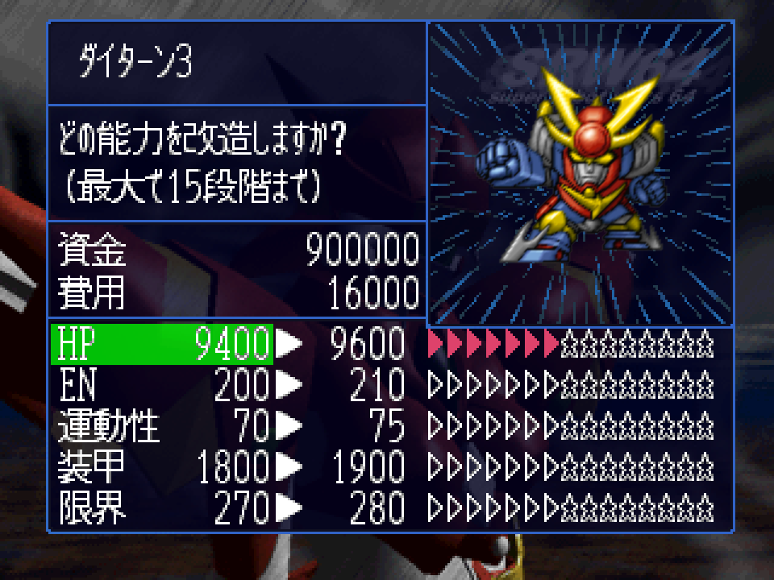
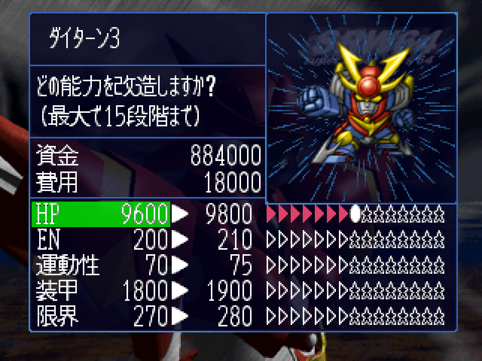
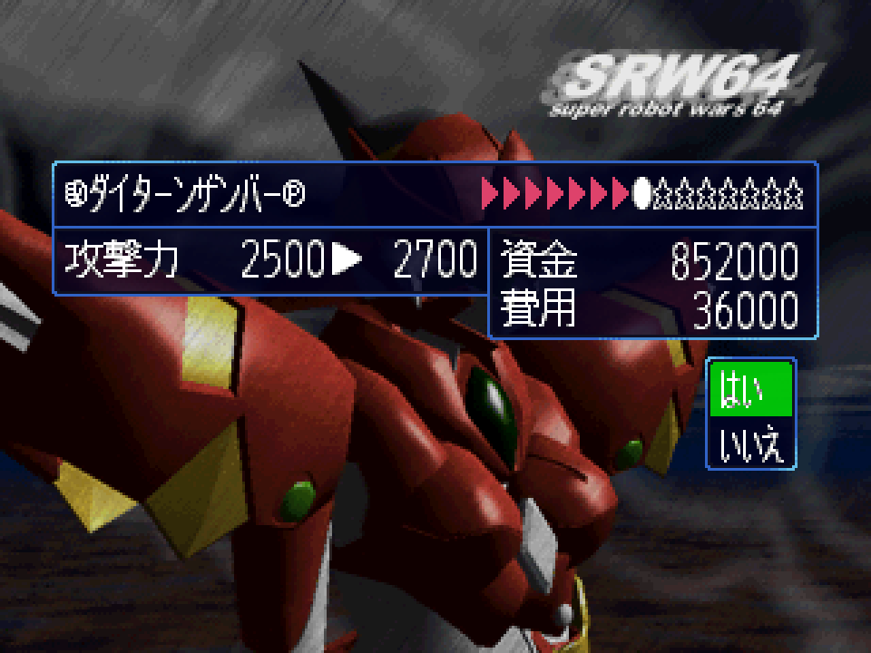
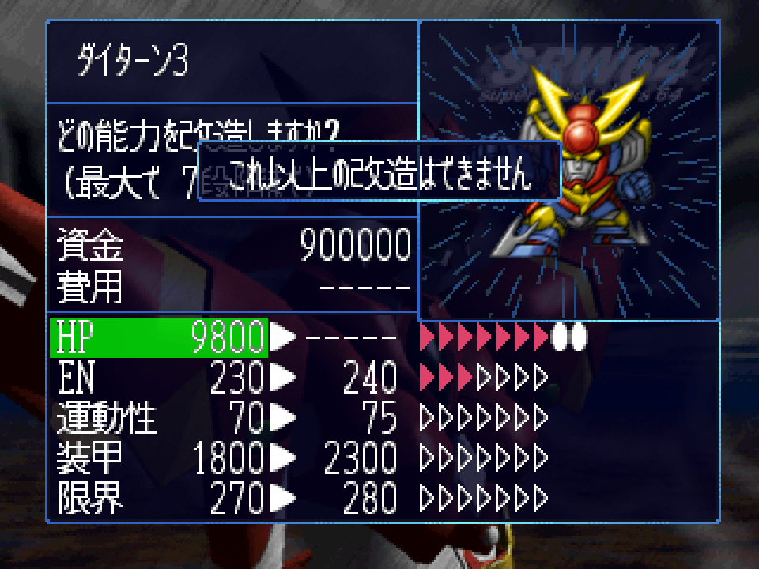
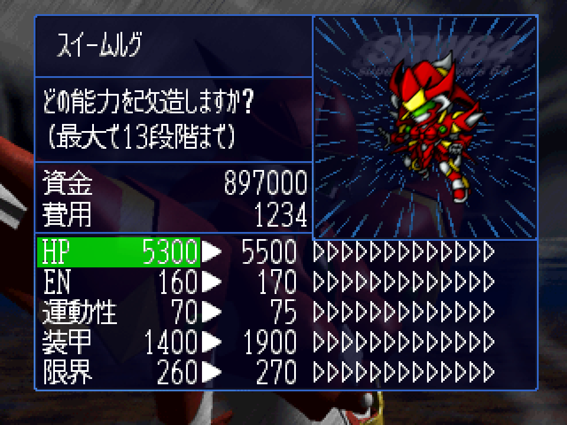

# 改造段数与“丑小鸭”上限：每段增量、价格、机体设置与 MOD 设计

日期：2026-09-18。范围：日版 Rev 0 ROM 与本项目的静态反汇编（`build/recomp/cpu-scan`）、已提取的机体／武器目录（`assets/original-data/records`）。第 1～6 节是静态分析；第 7 节的一期 MOD（数值可配置、上限突破到 15、改造画面显示原作上限）已实现，并在 2026-09-18 用两次有界运行核对了改造画面（7.5 节）；仍未实机确认的条目在第 8 节。换机时段数如何搬运见[改造继承分析](upgrade-inheritance.md)，本文不重复。

本文的“丑小鸭”指 SRW64 的机体改造上限按机体而异：强机只能改 7 段，弱机、量产机可以改到 13～15 段，改满后能反超起点更高的机体。

## 1. 结论摘要

| 结论 | 依据 |
| --- | --- |
| 整个“丑小鸭”系统只由**每台机体一个字节**决定：机体 ROM 记录 `+0x20` 的改造上限（原版取值 6～15）。五项能力和该机体的**每一件武器**共用这个上限 | `800A5330` 写入实例 `+0x51`；改造画面 `801CFA78`（五项）、`801D1318`（武器） |
| 每段增量与机体**无关**：五项各一张 15 段曲线，全体机体共用。上限高的机体只是能沿同一条曲线走得更远 | `800A5254` 的五个累加循环，表 `D_800CA4F0`～`D_800CA570` |
| 每段价格也与机体和上限**无关**：只看“这一项现在是第几段” | `801CF988` 内按段数查 `D_801DC36C` 等五张表 |
| 武器按**改造类型**（武器 ROM 记录 `+0x0E`）分 5 类：类型 1～4 各有一条增量曲线和一张价格表，类型 0 不可改造（增量全 0、价格 0） | 增量 `800A55F4` 起的循环查 `D_800CA590`；价格 `801D0C7C` 按实例 `+0x15` 分支 |
| 增量表有**两份**：常驻表用于重算能力，改造画面 overlay 里另有一份“预览”表，确认改造时直接把预览值加到当前机体上。两份原版数值一致，改其中一份会造成不一致 | `801CFD1C` 等处加 `D_801DC4AC[段数]`；`800A5254` 用 `D_800CA4F0` |
| 所有表都只到 15 段（价格表第 16 项是哨兵 99999），刻度条字符串只准备了上限 5～15 这 11 档。**只把上限调到 15 以内，不需要任何新数据**；超过 15 必须由宿主接管数值、价格、预览和刻度 | 第 3、5 节 |
| 上限还决定：EW 换装触发、满改追加武器、机体出售价、`3D6C` 的写入上限。做“突破上限”时这些都要保持按**原作上限**判断 | 第 5 节 |
| 存档把五项段数和每件武器段数各存 **4 位**，上限 15 也是存档格式的上限；上限字节 `+0x51` 不存档，读档后由 ROM 重算 | `80092240`（机体）、`80092498`（武器），见 4.3 节 |
| 与 Akurasu 的改造费用对照：ν 的フィンファンネル 140,000、マジンガーZ(JS) 的ロケットパンチ 364,000 与本文模型完全一致；ウイングゼロ 的ツインバスターライフルMAP 攻略写 110,000，模型算出 140,000，不一致 | 第 3.3 节 |

## 2. 每段提升多少（问题 1）

### 2.1 机体五项

`800A5254(机体实例, 模式)` 是全游戏唯一的能力重算函数：从机体 ROM 记录回读基础值，再按实例 `+0x4C..+0x50` 的五个段数逐段累加增量表。第 0 项固定为 0，段数 L 加的是第 1～L 项。

| 段 | 1～5 段每段 | 6～15 段每段 | 实例字段 | 常驻增量表（ROM） |
| --- | --- | --- | --- | --- |
| HP | +200 | +200 | 最大 HP `+0x06` | `D_800CA4F0`（`0x54EE0`） |
| EN | +10 | +20 | 最大 EN `+0x0A` | `D_800CA510`（`0x54F00`） |
| 运动性 | +5 | +10 | `+0x10` | `D_800CA530`（`0x54F20`） |
| 装甲 | +100 | +150 | `+0x12` | `D_800CA550`（`0x54F40`） |
| 限界 | +10 | +20 | `+0x14` | `D_800CA570`（`0x54F60`） |

按上限计的满段累计提升（原版出现的上限值）：

| 上限 | HP | EN | 运动性 | 装甲 | 限界 |
| --- | --- | --- | --- | --- | --- |
| 6 | +1200 | +70 | +35 | +650 | +70 |
| 7 | +1400 | +90 | +45 | +800 | +90 |
| 8 | +1600 | +110 | +55 | +950 | +110 |
| 9 | +1800 | +130 | +65 | +1100 | +130 |
| 10 | +2000 | +150 | +75 | +1250 | +150 |
| 11 | +2200 | +170 | +85 | +1400 | +170 |
| 12 | +2400 | +190 | +95 | +1550 | +190 |
| 13 | +2600 | +210 | +105 | +1700 | +210 |
| 15 | +3000 | +250 | +125 | +2000 | +250 |

“丑小鸭”的量级就在这张表里：上限 15 的机体改满，运动性比上限 7 的机体多 +80，装甲多 +1200。

### 2.2 武器威力

武器实例（步长 0x24，机体实例 `+0x2C` 件数、`+0x30` 指针）的威力 `+0x06` = 武器 ROM 记录 `+0x01` × 100 + 增量表前 L 项之和，L 是武器实例 `+0x16` 的段数。增量表按武器实例 `+0x15`（改造类型，由 `800A6A98` 从武器 ROM 记录 `+0x0E` 复制）选行，每行 15 项，表 `D_800CA590`（ROM `0x54F80`，5 行 × 15 项 u16，末尾一个 0）。

| 类型 | 第 1～15 段每段增量 | 满 15 段累计 | 原版武器数 |
| --- | --- | --- | --- |
| 0 | 全 0（不可改造，见第 6.1 节） | 0 | 102 |
| 1 | 100,100,150,150,200,200,200,200,200,250,250,250,250,250,300 | +3050 | 541 |
| 2 | 100,100,150,150,150,150,200,200,200,200,250,250,250,250,300 | +2900 | 616 |
| 3 | 与类型 2 相同 | +2900 | 3（120mmキャノン砲、ミサイルランチャー、スペシャルボロットパンチ） |
| 4 | 100,100,150,150,150,150,150,150,200,200,200,200,200,200,300 | +2600 | 67（バルカン砲、対空機関砲等） |

类型 2 与类型 3 的威力曲线完全相同，只有价格不同（第 3.2 节）。按上限计的满段累计威力：上限 7 为类型 1 +1100／类型 2、3 +1000／类型 4 +950；上限 9 为 +1500／+1400／+1300；上限 13 为 +2500／+2350／+2100；上限 15 为 +3050／+2900／+2600。

类型 0 包括：合体技（ツインビーム、ダブルゴッドフィンガー 等）、修理装置／補給装置、シャッフル同盟与ゴッドガンダムH 的必杀技、ドモン 生身的パンチ／キック／突進，以及一批敌方专用武器。

## 3. 每段消耗多少资金（问题 2）

价格表都在改造画面 overlay `load_0008F4B0`（ROM `0x8F4B0`，VRAM `801C4500`；表的 ROM 偏移 = VRAM − `0x801C4500` + `0x8F4B0`），每张 16 个 u32，按**当前段数**取价（第 0 项是 0→1 段的价格），第 16 项固定是 99999。资金是 `D_8010F5F4`（u32）；资金不足显示文本 4144「資金が足りません」，段数已达上限显示文本 4143「これ以上の改造はできません」。价格为 0 或 99999 时，五项界面显示成 `-----`。

### 3.1 机体五项

| 当前段 → 下一段 | 0→1 | 1→2 | 2→3 | 3→4 | 4→5 | 5→6 | 6→7 | 7→8 | 8→9 | 9→10 | 10→11 | 11→12 | 12→13 | 13→14 | 14→15 |
| --- | --- | --- | --- | --- | --- | --- | --- | --- | --- | --- | --- | --- | --- | --- | --- |
| HP `D_801DC36C` | 2000 | 4000 | 6000 | 8000 | 10000 | 12000 | 14000 | 16000 | 18000 | 20000 | 22000 | 24000 | 26000 | 28000 | 30000 |
| EN `D_801DC3AC` | 1000 | 1500 | 1500 | 2000 | 2000 | 3000 | 3000 | 4000 | 4000 | 5000 | 5000 | 6000 | 6000 | 7000 | 7000 |
| 运动性 `D_801DC3EC` | 5000 | 8000 | 10000 | 12000 | 15000 | 20000 | 25000 | 30000 | 35000 | 40000 | 45000 | 50000 | 55000 | 60000 | 65000 |
| 装甲 `D_801DC42C` | 3000 | 5000 | 8000 | 10000 | 15000 | 20000 | 25000 | 30000 | 35000 | 40000 | 45000 | 50000 | 55000 | 60000 | 65000 |
| 限界 `D_801DC46C` | 与 EN 相同 |

五张表的 ROM 偏移依次为 `0xA731C`、`0xA735C`、`0xA739C`、`0xA73DC`、`0xA741C`。

按上限计的满段总价：

| 上限 | HP | EN | 运动性 | 装甲 | 限界 | 五项合计 |
| --- | --- | --- | --- | --- | --- | --- |
| 6 | 42,000 | 11,000 | 70,000 | 61,000 | 11,000 | 195,000 |
| 7 | 56,000 | 14,000 | 95,000 | 86,000 | 14,000 | 265,000 |
| 9 | 90,000 | 22,000 | 160,000 | 151,000 | 22,000 | 445,000 |
| 11 | 132,000 | 32,000 | 245,000 | 236,000 | 32,000 | 677,000 |
| 13 | 182,000 | 44,000 | 350,000 | 341,000 | 44,000 | 961,000 |
| 15 | 240,000 | 58,000 | 475,000 | 466,000 | 58,000 | 1,297,000 |

### 3.2 武器

武器价格同样只看类型和当前段数，**与机体上限无关**；每段价格是等差数列：

| 类型 | 第 n 段（0 起）的价格 | 价格表（ROM） | 满 7 段 | 满 9 段 | 满 13 段 | 满 15 段 |
| --- | --- | --- | --- | --- | --- | --- |
| 1 | 5000 × (n+1) | `D_801DC7BC`（`0xA776C`） | 140,000 | 225,000 | 455,000 | 600,000 |
| 2 | 4000 × (n+1) | `D_801DC77C`（`0xA772C`） | 112,000 | 180,000 | 364,000 | 480,000 |
| 3 | 3000 × (n+1) | `D_801DC73C`（`0xA76EC`） | 84,000 | 135,000 | 273,000 | 360,000 |
| 4 | 2000 × (n+1) | `D_801DC6FC`（`0xA76AC`） | 56,000 | 90,000 | 182,000 | 240,000 |
| 0 | 不查表，价格 0 | — | — | — | — | — |

### 3.3 与攻略数字的对照

Akurasu “Unit Upgrades” 页列了三件满改追加武器的累计费用：

| 武器 | 攻略 | 本文模型 | 结果 |
| --- | --- | --- | --- |
| νガンダム フィンファンネル（上限 7，类型 1） | 140,000 | 5000 × (1+…+7) = 140,000 | 一致 |
| マジンガーZ(JS) ロケットパンチ（上限 13，类型 2） | 364,000 | 4000 × (1+…+13) = 364,000 | 一致 |
| ウイングゼロ ツインバスターライフルMAP（上限 7，类型 1） | 110,000 | 140,000 | 不一致；任何类型、任何上限的累计价都不等于 110,000，疑为攻略笔误，待实机确认 |

## 4. 不同机体的设置在哪里（问题 3）

### 4.1 字段与表

| 设置 | 位置 | 运行时 | 说明 |
| --- | --- | --- | --- |
| 机体改造上限 | 机体 ROM 记录 `+0x20`（记录表 ROM `0x71B80` + 机体号 × 36） | 实例 `+0x51` | 新建实例时写入（`800A7100`、`800A8DF0`），每次 `800A5254` 重算时从 ROM 重写 |
| 五项段数 | — | 实例 `+0x4C` HP、`+0x4D` EN、`+0x4E` 运动性、`+0x4F` 装甲、`+0x50` 限界 | 机体实例表 `D_8016A210`，140 项 × 0x54 |
| 武器改造类型 | 武器 ROM 记录 `+0x0E`（记录表 ROM `0x74E90` + 武器号 × 16） | 武器实例 `+0x15` | 只在建武器实例时复制（`800A6A98`） |
| 武器段数 | — | 武器实例 `+0x16` | 按件独立；上限是所在机体的 `+0x51` |
| 五项增量（能力计算用） | `D_800CA4F0`～`D_800CA570`，ROM `0x54EE0` 起，5 × 16 u16 | 常驻 RDRAM | 第 0 项为 0 |
| 五项增量（界面预览与确认用） | `D_801DC4AC`～`D_801DC52C`，ROM `0xA745C` 起，5 × 16 u16 | overlay | 第 n 项 = 第 n+1 段的增量，末项 0 |
| 武器增量（威力计算用） | `D_800CA590`，ROM `0x54F80` | 常驻 | 类型 × 15 项 |
| 武器增量（界面预览） | `D_801DC85C`（类型 1）、`D_801DC83C`（2）、`D_801DC81C`（3）、`D_801DC7FC`（4），ROM `0xA780C`／`0xA77EC`／`0xA77CC`／`0xA77AC` | overlay | 与常驻表逐项一致 |
| 五项与武器价格 | 第 3 节 | overlay | — |
| 刻度条 | `D_801DC340`（ROM `0xA72F0`）：11 个指针，按“上限 − 5”选一组文本号，再按当前段数取一条 | overlay | 文本 4145～4267，如上限 7 的第 3 段是「▶▶▶▷▷▷▷」；上限 5 与 14 两档有字符串但没有机体使用 |
| 满改追加武器 | `D_801DC87C`（ROM `0xA782C`），18 条（机体、满改武器、解锁武器），999 结束 | overlay | 见第 5 节 |
| EW 换装 | `D_801DC6E4`（ROM `0xA7694`），5 对 | overlay | 见[改造继承分析](upgrade-inheritance.md) 2.1 节 |
| 敌方段数 | 部署记录 `+12`（强化索引）→ `D_800CB5DC`（ROM `0x55FCC`）：0,1,3,5,7,9,11,13,15 | 部署时写五项，新建实例时全部武器写同一值 | 原版只用索引 0～5（段数 0～9），全部不超过该机体的上限 |

### 4.2 原版上限分布

363 条机体记录：上限 6 一台、7 四十台、8 五台、9 五十一台、10 十八台、11 三十四台、12 一台、13 二十八台、15 一百八十五台（多为敌方机体）。上限是逐台手工设定的，不是由基础能力换算出来的，但趋势明确：强机低、弱机高。我方常用机体举例（原脚本用 `3D5A` 登记过的机体与合体形态）：

| 上限 | 机体 |
| --- | --- |
| 6 | ガンダムサンドロック（全表唯一） |
| 7 | νガンダム、量産型νガンダムF、W 系 TV 版与 EW 版（初代ガンダムサンドロック 除外；ウイング、ゼロ、デスサイズ系、ヘビーアームズ系、シェンロン／アルトロン系、サンドロック改／カスタム、エピオン）、ゲッター1／ドラゴン／真・ゲッター、ダイターン3、ゴッドマーズ、ドモン 生身 |
| 8 | ザンボット3 系（ザンバード、ザンブル、ザンベース、ザンボエース） |
| 9 | ゴッド／シャイニングガンダム、シャッフル同盟四机、ZZ、mkⅢ、百式、フルアーマー百式改、キュベレイmkⅡ、ヤクト・ドーガ、トールギスⅢ、ダンクーガ、グレンダイザー 各形态、スペイザー、レイズナー、ニューレイズナー、サーバイン、ビルバイン、ズワウス、アシュクリーフ、ラーズグリーズ |
| 10 | コン・バトラーV 与五机、ダンクーガ 的四机（イーグルファイター、ビッグモス、ランドクーガー、ランドライガー） |
| 11 | Zガンダム、スーパーガンダム、ディジェSE-R、メタス改、リ・ガズィ(BWS)、量産型νガンダムI、GP03、ノイエ・ジール、トールギス、ピースミリオン、グレートマジンガー、量産型グレート、シュピーゲル、ノーベル、ライジング、ゼーロン、ヴァイローズ、スーパーアースゲイン、スイームルグS、バルディ、ベイブル |
| 12 | マジンガーZ（全表唯一；JS 版是 13） |
| 13 | 各母舰（アーガマ、ネェル・アーガマ、ラー・カイラム、アルビオン、アウドムラ、ラビアンローズ、グラン・ガラン、ゴラオン）、ガンダムmkⅡ、マジンガーZ(JS)、ビューナスA、ダブル／ドリル／マリンスペイザー、ジャイアント・ロボ、ブラックウイング、ダンバイン、バストール、グライムカイザル、ガイヤー、トーラス、ノウルーズ、シグルーン |
| 15 | ガンダム、ガンキャノン、ガンタンク、ジェガン、シュツルム・ディアス、ガンダムEz8、Gディフェンサー、ダイアナンA、ボスボロット、ミネルバX、ボチューン、ドール、コスモクラッシャー、銀鈴ロボ、エルブルス、シャトル号 |

同一合体／变形族内上限不一定相同：ガンダムmkⅡ 13 与 スーパーガンダム 11，ダンクーガ 四机 10 与 ダンクーガ 9，スペイザー 各型 13 与 グレンダイザー 9，ガイヤー 13 与 ゴッドマーズ 7。其中 mkⅡ→スーパーガンダム 会触发段数越限，见第 6.3 节。

### 4.3 存档里的段数

中断存档（`800924D8` 写入 `801C2600` 缓冲，SRAM `0x10` 起）不保存机体实例原样，而是逐台压缩成 16 字节（`80092240`）：`+0` 为 机体号<<6 | 武器件数，`+2` 为 HP<<4 | EN，`+3` 为 运动性<<4 | 装甲，`+4` 为 标志（高 2 位）| 限界，`+0xE` 为该机第一件武器的序号。武器每件 6 字节（`80092498`）：编号、可用形态、段数<<4 | 标志低 4 位。资金是块内 `+0x54` 的 u32（`800918DC`）。

所以五项和武器段数在存档里都只有 4 位，**15 是存档格式本身的上限**；上限字节 `+0x51` 和能力数值都不存，读档后由段数重算。这决定了 MOD 的边界：突破到 15 以内不碰存档格式，超过 15 必须另存段数（第 7.6 节）。`tools/recomp/gameplay/upgrade_save.py` 按此格式做受控存档编辑（资金、段数），仅供核对用。

## 5. 上限的全部读者

全部读 `+0x51`（或 `D_8016A261` + 实例偏移）的代码，按用途分：

| 用途 | 位置 | 规则 |
| --- | --- | --- |
| 五项可否再改 | `801CF988` 内 `801CFA78`；确认 `801CFCA4` 起 | 段数 < 上限才能改；确认时先扣钱、加预览增量，再在 < 上限时 +1 |
| 五项价格显示 | `801CF988` 内 `801D0168` 起 | 段数 < 上限才查价，否则显示 `-----` |
| 五项预览与刻度 | `801C80E0`（`801C8194` 取刻度、`801C8224` 取预览） | 段数 = 上限时显示 `-----`；刻度 `D_801DC340[上限−5][段数]` |
| 武器价格、预览与刻度 | `801D0C7C` | 段数 = 上限时显示“これ以上の改造はできません” |
| 武器确认 | `801D1100`（`801D1318`、`801D1384`） | 扣钱、威力写成预览值；段数 < 上限才 +1；随后段数 **= 上限**时调用 `801D0AE4` 解锁追加武器 |
| 满改追加武器 | `801D0AE4`，表 `D_801DC87C` | 机体号与刚改满的武器号都匹配时，清除目标武器 `+0x22` 的位 2（解锁位）。例：ν フィンファンネル→フィンファンネルMAP、mkⅡ／スーパーガンダム 拡散バズーカ→MAP、キュベレイmkⅡ ファンネル→MAP、ゼロ ツインバスターライフルMAP→2MAP、ヘビーアームズ改 ダブルガトリングガン→全弾発射MAP、グレート ブレストバーン→MAP、マジンガーZ(JS) ロケットパンチ→大車輪ロケットパンチ 等 18 条 |
| EW 换装 | `801CF85C` | 五项段数**全部 ≥** 上限时调用 `800AAD28` 换机；不看武器 |
| 脚本 `3D6C` | `800ACA1C`（`800ACA74`） | 五项写成 min(N, 上限)，所有武器写成同一值 |
| 机体出售价 | 出售画面 overlay `load_00107BF0`（ROM `0x107BF0`）`801C2600` | 价格 = 基础价 + 20000 × (五项段数 + 全部武器段数) ÷ (上限 × (武器件数 + 5))；基础价表 `D_801C3A40`（ROM `0x109030`），表中 12 个机体号、9 种量产机可卖（ガンキャノン 11000、ガンダム 12000、ガンタンク 10000、ジェガン 13000、シュツルム・ディアス 13000、リ・ガズィ(BWS) 15000、Ez8 11000、ドール 10000 等）；比例部分取整 |
| 换机继承 | `800AAD28`、`800A9A70`、`800AA8C0` | 复制上限后被 `800A5254` 重置，无实际影响（[改造继承分析](upgrade-inheritance.md) 第 5 节） |
| 实例整块备份 | `800ACD5C` | 连同上限一起复制，不做判断 |

武器改造成功后，`800A5F84` 会把威力和段数同步到同一机体上的“孪生武器”：`232 ↔ 254` ビームサーベル（ガンダムmkⅡ／スーパーガンダム）、`873 ↔ 880` 断空剣（ダンクーガ 两个编号）。五项改造成功后，`800A5924` 把五个段数复制到合体族、变形族中的在场形态，并对每个形态调用 `800A5254` 重算。

## 6. 旁证与潜在问题

### 6.1 类型 0 武器：只挡住了威力为 0 的

武器改造列表（`801C7254`）只排除 `+0x22` 位 1 或位 2 置位的武器（合体技带位 1，位 2 是未解锁）；进入确认前（`801D087C` 的 `801D0970`）只拒绝**威力为 0** 的武器。因此：

- 修理装置、補給装置（威力 0）点了只有提示音，不能改造；
- ツインビーム 等合体技（位 1）根本不在列表里；
- 但威力大于 0 的类型 0 武器没有被挡住。按代码，确认时价格为 0、威力被写成预览值 0、段数 +1，直到下一次 `800A5254` 重算才恢复原威力。

这类武器在我方只出现在ゴッドガンダムH、シャッフル同盟四机的 S 形态和ドモン 生身上。列表按“当前形态的机体号”筛选武器，所以只要整备时这些机体处于基础形态，这条路径就走不到。**这是静态推断的潜在问题**，登记为 [WATCH05](original-bug-register.md)；MOD 接管改造逻辑时应把类型 0 明确当作“不可改造”。

### 6.2 上一份文档的订正

[改造继承分析](upgrade-inheritance.md) 8.3 节原写“`D_801DC340[上限−5]` 选出该机体档位的表，再按武器类别取价”。实际 `D_801DC340` 是刻度条字符串表，武器价格只由改造类型和当前段数决定，与机体上限无关；“武器类别字段”就是武器记录 `+0x0E`。该文第 7 节第 3、4 项也可以由本文静态解决：断空剣 873／880 在每次改造时由 `800A5F84` 同步；修理装置威力为 0、ツインビーム 带合体技位，都不能单独改造，映射表里没有它们不造成实际损失。三处已在原文订正。

### 6.3 ガンダムmkⅡ → スーパーガンダム 的段数越限

`800A5924` 末段硬编码了两组传播：源机体 56 ガンダムmkⅡ → 61 スーパーガンダム，源机体 158 グレンダイザー → 159～161 各形态。mkⅡ 上限 13，スーパーガンダム 上限 11，所以 mkⅡ 改到 12、13 段后，スーパーガンダム 的五项段数就超过了自己的上限：能力按 13 段计算（增量表够长，数值正常），改造画面则不能再改，刻度按 `D_801DC340[6][13]` 读到下一档（上限 12）的字符串，画面上会是一条错位的刻度。静态可确定越限本身；刻度的实际画面待实机确认。**这说明原版就存在“段数超过上限”的状态，突破上限的 MOD 在关掉开关后遇到同样的状态，处理办法一致。**

## 7. MOD：可设置的数值与“突破上限”（一期已实现）

### 7.1 用法

两部分互相独立，可以单独或同时使用：

| 部分 | 怎么开 | 作用范围 |
| --- | --- | --- |
| 上限突破 `upgrade-cap-break` | [可选规则](rule-fixes.md)的“难度调整”，默认关闭。游戏内「选项 → 游戏性调整」即时开关，或 `play_native.py --rule-fixes upgrade-cap-break` | 只有改造画面：所有机体可改到 15 段 |
| 升级规则文件 | `play_native.py --upgrade-rules FILE`（每次启动指定，不记忆）；底层是环境变量 `SRW64_UPGRADE_RULES` | 五项与武器四类的每段增量和价格、任意机体的原作上限、任意武器的改造类型 |

规则文件模板：

```sh
.venv/bin/python tools/recomp/gameplay/upgrade_rules.py export my-rules.json --units --weapons
.venv/bin/python tools/recomp/gameplay/upgrade_rules.py check my-rules.json
```

`export` 写出原版数值（`--units`／`--weapons` 另附全部 363 台机体的上限和 1329 件武器的类型，带名称），改需要的项、删掉其余即可；每一节、每个字段都可省略，省略的沿用原版。格式（schema `srw64.upgrade-rules.v1`）：

```json
{
  "schema": "srw64.upgrade-rules.v1",
  "stats": {"hp": {"increments": [15 个], "prices": [15 个]}, "en": ..., "mobility": ..., "armor": ..., "limit": ...},
  "weapon_types": {"1": {"increments": [...], "prices": [...]}, "2": ..., "3": ..., "4": ...},
  "unit_caps": [{"id": 124, "name": "ガンダムサンドロック", "cap": 7}],
  "weapon_type_overrides": [{"id": 19, "type": 2}]
}
```

校验（Python 与宿主同一套，坏文件在启动前就被拒绝）：曲线正好 15 项；每段增量 0～9999 且 15 段之和不超过 30000（能力值是 u16）；价格 1～99998（0 与 99999 是界面的 `-----` 哨兵）；上限 5～15（刻度表只有这 11 档）；武器类型 0～4；未知字段一律报错。`increments[n]` 是第 n+1 段的增量，`prices[n]` 是从第 n 段升到 n+1 段的价格。

### 7.2 两种上限

| 用途 | 用哪个上限 |
| --- | --- |
| 改造画面：能否再改、价格、预览、刻度、“最大で N 段階まで” | **有效上限**：开了突破为 15，否则为原作上限 |
| EW 换装、满改追加武器、出售价、`3D6C`、换机继承 | **原作上限**（ROM 值，或规则文件 `unit_caps` 的值） |

`unit_caps` 改的是“原作上限”本身，所以会连带改变 EW、追加武器与出售价的判定；突破只影响改造画面。

### 7.3 实现

代码在 `src/host/upgrade_rules.hpp`，包装在 `game_hooks.cpp`，绑定在 `generate_cpu.py` 的 `NATIVE_HOOKS`。

- **数值**：规则文件读入后算出与 ROM 不同的每个字节（常驻增量表、overlay 的价格表与预览表、机体记录 `+0x20`、武器记录 `+0x0E`），在每次 ROM 拷贝之后打补丁：启动时的常驻段、`8007F704` 的每次读（overlay 载入在字节校验之后、机体和武器记录读取）。游戏继续用自己的表，预览表与常驻表同步改写，所以确认改造时加上的值和之后 `800A5254` 重算的值一致。武器实例只在建立时复制类型，`800A5254` 的包装会先按规则文件刷新 `+0x15`。没有文件时补丁表为空，不写任何内存。
- **上限**：改造画面的六个例程各包一层作用域——`801CF680`（打开画面，打印上限）、`801CF988`（五项的选择与确认）按“能否改”，`801C80E0`（五项的数值、预览与刻度）按“显示”，`801D0C7C`／`801D1100`（武器的预览与确认）按“所选武器”，`801CF85C`（EW 判定）按原作上限。进入时把所有在场机体的 `+0x51` 写成该作用域的上限，退出时写回，只写与现值不同的字节；`800A5254` 会从 ROM 重写 `+0x51`，其包装在作用域内把它补回。画面之外的代码永远只看到原作上限，而且 `+0x51` 不进存档（4.3 节）。
- **满改追加武器**：`801D1100` 在段数 +1 之后调用 `800A5F84`，再比较“段数 = `+0x51`”。`800A5F84` 的包装在所选武器属于 `D_801DC87C` 时调整这一比较：段数刚到原作上限时让比较成立（追加武器照原作时机解锁，提示照常），到了突破后的上限时让比较不成立（不重复解锁）。
- **已超过上限的段数**：关掉突破后，之前改上去的段数保留。显示作用域把刻度放宽到已有段数，避免按段数越界取字符串；武器作用域让超限的武器看到自己的段数，画面直接提示“これ以上の改造はできません”，不会像原版比较那样先扣钱再不加段。原版 ガンダムmkⅡ→スーパーガンダム 的越限（6.3 节）同样走这条路，刻度因此不再错位。
- **出售价**：`load_00107BF0` 的 `801C2600` 结果钳到“基础价 + 20000”，原版数据下永远不触发。
- **刻度**：`8008C510`（文本描述符）和 `8007F704` 的包装在显示作用域内、当前机体的有效上限或已有段数超过原作上限时，把刻度文本换成按该机体现拼的字符串：原作上限以内用原字形 ▶／▷，超出部分用 ●（已改）／☆（未改）。开突破时画满 15 格；不开时只画到已有段数。

### 7.4 测试

- `make recomp-upgrade-rules-test`（已加入 `recomp-native-check`）：用真 ROM 核对原版表、刻度文本号与上限，覆盖规则文件校验、字节补丁（含部分拷贝）、记录覆盖、类型刷新、各作用域的上限与嵌套、`800A5254` 后补回、追加武器的两种调整、出售价钳位、刻度字符串的两种宽度。
- `tests/test_upgrade_rules.py`：Python 校验与宿主常量一致、钩子已绑定、ROM 原值与分布、模板完整、受控存档编辑。

### 7.5 实机核对（2026-09-18，有界运行，日文、Original 画面）

用 `tools/recomp/gameplay/upgrade_save.py` 对第一话通关存档做**受控编辑**（资金 900000；ダイターン3 三个形态 HP 段数、ダイターンザンバー 段数），走 `load-intermission-check.json` 的前 9 个输入读档进中断，再逐键操作改造画面。下列截图保存在 `docs/media/`（编号 15～19），来源与摘要见[媒体记录](../media/manifest.json)；运行目录本身不保留。

| 运行 | 条件 | 画面所见 |
| --- | --- | --- |
| `run-on-2` | 突破开；ダイターン3（上限 7）HP 7 段，ザンバー 7 段 | 读档后 HP 9400（8000 + 7×200）；画面标题「最大で15段階まで」；HP 费用 16000、预览 9400→9600，刻度 7 格 ▶ + 8 格 ☆。确认后 HP 9600、资金 900000→884000、下一段费用 18000，刻度 7▶ + 1● + 7☆。ザンバー 2300（1300 + 类型 2 前 7 段 1000），费用 32000、预览 2500，确认后 2500、资金 852000、下一段 36000，刻度 7▶ + 1● + 7☆；武器表每页 6 行，与 `行 + 6×(页−1)` 一致 |
| `run-off-3` | 突破关；HP 9 段、EN 3 段、ザンバー 9 段；规则文件：HP 价格 1234、装甲每段 +500、スイームルグ 上限 11→13（补丁 91 字节） | ダイターン3 标题「最大で 7段階まで」，HP 显示 `-----`，刻度 7▶ + 2●，EN 刻度保持原作的 7 格；在 HP 上按 A 提示“これ以上の改造はできません”，资金不变；装甲预览 1800→2300，确认后 2300、资金 −3000（原版装甲价），回到列表重算后仍为 2300；スイームルグ 标题「最大で13段階まで」、HP 费用 1234、13 格原字形刻度；ザンバー（9 段）直接提示“これ以上の改造はできません”，资金始终 897000 |

两次运行宿主无失败记录（`report.json` 状态 `native-run-ended-by-control`，退出码 0），运行报告分别记下 `rule_fixes` 与 `upgrade_rules`（文件路径与摘要）。第一次尝试 `run-on-1` 误入新游戏，已丢弃。

| 突破开：打开画面，HP 在原作上限 7 | 突破开：HP 升到第 8 段 |
| --- | --- |
|  |  |
| **突破开：武器升到第 8 段** | **突破关：已超限的 HP 被拒绝** |
|  |  |
| **规则文件：スイームルグ 上限 13、HP 价格 1234、装甲 +500** | |
|  | |

### 7.6 限制与二期

- **15 段是硬边界**：表长、刻度表和存档格式都到 15 为止。超过 15 需要宿主接管能力重算、价格、预览和刻度，并把 4 位以外的段数另存进保存集合（[路线图](../design/mod-roadmap.md) M2 的存档协议），不在一期范围。
- 突破是开关而不是数值：所有机体一律可到 15。若要“原作上限 + N”，只需把 `allowed_cap()` 改为读取一个数值设置，界面上需要数值控件（[设置窗口规划](../native/settings-window.md) 已预留）。
- 规则文件在启动时读取，运行中不能换；突破开关可以随时切换，下一次进入改造画面的例程时生效。
- 武器威力显示是 4 位数、费用 5 位数，规则文件把数值调得过大时界面会截断，校验只保证不溢出 u16/u32。

## 8. 仍需实机确认的项目

1. 满改追加武器在突破开启时仍于原作上限解锁、提示正常，且到 15 段不重复（单元测试已覆盖逻辑；第一话名册里没有带追加武器的机体，本轮未走到）。
2. EW 换装在突破开启时仍于五项都达到原作上限时触发。
3. 6.1 节类型 0 武器的免费改造路径能否在原版流程中走到。
4. 出售画面在突破后的价格钳位。
5. ウイングゼロ ツインバスターライフルMAP 的实际累计价格（模型 140,000，攻略 110,000）。

返回：[改造继承分析](upgrade-inheritance.md) · [原版 Bug 登记](original-bug-register.md) · [可选规则修正](rule-fixes.md) · [内置 MOD 路线图](../design/mod-roadmap.md) · [技术文档索引](../README.md)
