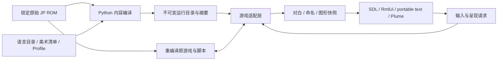

# 原生开发指南

更新：2026-09-18。本文描述当前源码和开发入口；内置功能模块的当前范围见[路线图](../design/mod-roadmap.md)，外部包与公开 API 暂缓。所有路径相对仓库根目录。

## 当前可用范围

开发入口是 `scripts/Play SRW64 Native.command` → `tools/recomp/run/play_native.py --profile config/recomp/profiles/play-profile.json`。它运行锁定的原始 JP Rev 0 ROM，由原脚本驱动游戏，并接入原生显示与输入。

| 能力 | 当前实现与限制 |
| --- | --- |
| 多语言 | F7 按 `ja` → `zh-Hans` → `en` 循环热切换，无弹窗并记住选择；标准双框对白与新增原生 UI 已接入。中英文各覆盖相同的 153 条草稿和全部 99 条原生 UI 文案，不是全游戏翻译。缺译按完整 TextKey 回退日文。 |
| Original / HD | F6 同时切换纯美术替换和 5600 模型；语言、字体、字号与分辨率不随 F6 改变。 |
| 5600 模型 | Original 保留原版八面模型；HD 按 profile 使用原生 GPU 水滴。任意模型包接口尚未开放。 |
| 阅读体验 | 四档自动、逐字、分页、回看、速度/进度和活动对话框指示；原脚本保留事件推进权。 |
| 存档恢复 | 历史 SRAM 按完成报告、ROM 身份和摘要筛选，支持列表/显式恢复；已验证第一话通关档冷启动到整备和驾驶员详情。安全节点自动保存尚未实现，见[恢复记录](native-save-recovery.md)。 |
| 姓名输入 | macOS 游戏窗口内的主角选择页与姓名页、原生字段与双人确认；原字库范围与原 7/7/5 字数上限。输入法组字可经调试接口模拟；任意 Unicode、SRAM 冷启动往返和输入法候选窗未验收。 |
| 玩法 Mod | `gameplay_mods` 必须为空。机体/人物/武器 schema、关卡编辑、内容类型注册和公开 SDK 仍是计划。 |
| 平台 | 只支持 macOS：图形宿主为 SDL2 + RT64/Metal，姓名页、菜单栏与设置窗口为 AppKit。其他平台暂不考虑。 |
| 调试 | `SRW64_DEBUG=1` 时宿主提供 JSON-RPC 调试接口，命令行与 MCP 可驱动全部游戏输入和原生界面，见[调试接口与 MCP](debug-interface.md)。 |

**退出生命周期：** 已增加游戏线程登记、协作停止、等待唤醒和完整 join，再释放 RDRAM；现代姓名→剧情关窗、原版姓名页关窗及 VI 自动退出均有最终版本验证。入口范围、系统采样缺失与剩余限制见[修复证据](../native/native-window-close.md)。这不替代存档冷启动恢复验收。

## 源码责任与数据流

| 位置 | 当前责任 |
| --- | --- |
| `src/srw64_rom/` | 原始 ROM 身份、资源/文本格式与编解码；供 recomp、数据提取和美术工具共用。 |
| `src/srw64_native/` | 离线编译语言目录、profile、美术包和姓名头像；校验输入与输出摘要。 |
| `src/native/localization/` | C++ TextKey、目录查找、原文回退、字体和 UI 文案。 |
| `src/native/game_adapter/` | 已拆出的对白来源识别与原始姓名字形编解码。 |
| `src/native/presentation/` | 原图/HD 模式请求与 display-list 快照归属。 |
| `src/host/host.cpp`、`game_hooks.*` | 原生宿主、N64 系统接入、overlay/资源钩子与 VI 控制。 |
| `native_dialogue.*`、`native_dialogue_text.cpp` | 原对白桥接与阅读状态；跨平台排版及场景绘制见 `src/host/dialogue_scene.cpp`。 |
| `native_name_entry.cpp` / `macos/native_name_entry_macos.mm` | 游戏线程上的命名请求、原校验与写回 / 窗口线程上的字段编辑与页面绘制。 |
| `graphics.cpp`、`native_marker.cpp`、`audio.cpp` | SDL/RT64 接入、GPU 水滴绘制、音频设备适配。 |
| `window_test_control.hpp`、`macos/window_test_control_macos.mm` | 默认关闭的窗口 QA：真实 Cocoa 关窗、SDL 缩放、与 F6 相同的图片模式请求；独立于命名页面。 |
| `tools/recomp/run/verification_support.py` | 验证脚本共用的等待、原子请求写入和退出线程日志解析。 |
| `tools/recomp/toolchain/prepare_runtime_lifecycle.py`、`src/host/runtime-support/` | 基于固定上游生成本地游戏线程/消息/调度/计时器退出适配，默认关闭系统线程诊断；生成代码与来源摘要写入 `build/`。 |

表中不带目录的宿主文件均位于 `src/host/`，AppKit 部分（`.mm`）在 `src/host/macos/`。2026-09-18 宿主从原来的 tools/recomp/native-host 迁入，`tools/recomp/` 的脚本按用途分入子目录：

| 目录 | 内容 |
| --- | --- |
| `tools/recomp/toolchain/` | 工具链与代码生成：`bootstrap.py`、`analyze_layout.py`、`scan_functions.py`、`generate_cpu.py`、符号与变体审计、`prepare_rt64.py`、`prepare_runtime_lifecycle.py` |
| `tools/recomp/run/` | 启动与驱动宿主：`play_native.py`、`run_host_probe.py`、`control_host.py`、`step_host.py`、输入编译与验证公共代码 |
| `tools/recomp/verify/` | 有界实机验证：语言切换、原生对白、姓名页、图片模式、阅读指示、关窗 |
| `tools/recomp/script_lab/` | 脚本注入、迷你关卡、场景脚本阅读与按指令切音频 |
| `tools/recomp/gameplay/` | 改造规则文件与受控存档编辑 |
| `tools/recomp/model5600/` | 5600 模型的高模、原生水滴与对应验证 |
| `tools/recomp/probes/` | 帧／音频／LZ／CoreText 重放探针、参考模拟器与 RSP 捕获 |
| `tools/recomp/analysis/` | 帧、脚本、移动与状态对比的离线分析 |
| `tools/recomp/debug/` | 调试接口的会话客户端、命令行 `srw64ctl.py` 与 MCP 服务器，见[调试接口与 MCP](debug-interface.md) |

子目录共同组成 `recomp` 包：脚本把 `tools/` 加入 `sys.path` 后以 `from recomp.toolchain.analyze_layout import ROOT` 这样的形式互相引用，测试同理。配置目录同样拆分：`config/recomp/` 只放工具链与构建配置，`profiles/` 放试玩档案，`inputs/` 放有界运行的输入脚本（迷你关卡的在 `inputs/mini-stages/`），`mini-stages/` 只放关卡定义。导出的数据与 HD 素材在不入库的 `assets/`，见 [`assets/README.md`](../../assets/README.md)。



窗口回调提交请求，姓名字段由游戏线程在已验证时机应用。图像切换由渲染线程确认，先等已提交 workload/present 完成，再同步替换开关。对白和命名遮挡按 workload 匹配，不能用“最新一份状态”覆盖仍在呈现的旧帧。内存地址、overlay 身份和游戏写入继续属于内部适配层，尚未成为公开 ABI。

## 构建与日常检查

`make` 一条命令从新克隆构建到可运行的游戏宿主（需要仓库根目录的 `rom.z64`），依次执行：

| 目标 | 作用 |
| --- | --- |
| `bootstrap` | 用 `PYTHON3`（默认 `python3`，需 3.11+）建立 `.venv` 并安装本项目；之后各步都在 `.venv` 里运行 |
| `recomp-bootstrap` | 按 `config/recomp/toolchain.json` 下载固定版本的上游依赖，编译 N64Recomp、RSPRecomp、n64sym |
| `recomp-layout`、`recomp-scan` | 核对 ROM 布局，扫描函数边界 |
| `recomp-cpu` | 生成 CPU 代码；libultra 候选符号取自入库的 `config/recomp/n64sym-symbols.txt` |
| `host` | `run_host_probe.py --graphics --build-only`：准备 RT64，编译 `build/recomp/gfx-build/srw64-gfx-host`，不启动 |

各目标也可单独运行。基础 Python 检查不需要 ROM、字体或模拟器：`make bootstrap check`。

`run_host_probe.py` 会复核 ROM 变体、代码兼容性、生成结果与上游版本，并按需配置/构建宿主。HD 模式要求 `content/art/stage1-hd.json` 和 `content/ui/name-entry.json` 引用的本地美术文件存在且摘要一致。profile 默认 `images: original`：Original 在缺少 HD 素材时从原 ROM 提取原图启动，新克隆不需要 `assets/`；`--new-game` 不依赖开发者本地通关档。当前没有预编译发布包。

已经配置 `build/recomp/gfx-build` 后，只编译、不启动游戏：

```sh
cmake --build build/recomp/gfx-build \
  --target srw64-gfx-host srw64-frame-host srw64-coretext-frame-host -j 6
make recomp-native-check
```

`recomp-native-check` 汇集音频队列、开场控制/适配、姓名桥接、内容、跨平台对白、计时器退出、游戏线程退出、VI 回放、随机状态探针、脚本注入、迷你关卡、可选规则、基础修复、改造规则、离队退款、Link Battler 虚拟卡带和调试协议测试，共 18 个测试程序。其中独立编译的 16 个程序使用 ASan/UBSan，内容/对白两个程序使用当前 CMake 配置。它不启动游戏，不替代 GPU 或整条关卡验收。需要 ROM/旧捕获的历史布局与姓名测试继续按各自文档运行。

运行时适配不直接编辑固定 N64ModernRuntime checkout，而是在 `build/recomp/runtime-lifecycle/` 生成对应源文件和 manifest。RT64 适配由 `prepare_rt64.py` 独立管理并记录来源。手写代码、配置和 manifest 规则是源码；生成的 CPU/RSP C、依赖克隆和构建日志都留在 `build/`。

## 静音验证与窗口控制

新的实机检查优先用[调试接口](debug-interface.md)：`srw64ctl.py launch` 启动隔离会话后按键、截图、读状态、操作原生界面，不需要人工按键。下面的文件控制通道继续服务已有的有界验证脚本。

交互检查可使用新增的静音参数：

```sh
.venv/bin/python tools/recomp/run/play_native.py \
  --profile config/recomp/profiles/play-profile.json --new-game --mute
```

自动探针默认静音，**测试时不传 `--audio`**；例外是要分辨只有声音不同的演出指令时（见[迷你关卡](../script/mini-stage.md)的开音频运行），此时必须同时给出采集窗口。完整命名流程需要两个终端，先启动宿主，再启动验证脚本；运行目录必须不存在：

```sh
SRW64_NAME_ENTRY_CONTROL=1 SRW64_WINDOW_CONTROL=1 SRW64_SHUTDOWN_TRACE=1 \
.venv/bin/python tools/recomp/run/run_host_probe.py \
  --graphics --profile config/recomp/profiles/play-profile.json \
  --input config/recomp/inputs/native-name-entry.json \
  --output build/recomp/qa/new-name-window --vis 9000
```

```sh
.venv/bin/python tools/recomp/verify/verify_native_name_entry.py \
  --run build/recomp/qa/new-name-window --exit-mode window
```

改为 `--exit-mode control` 可以对照 VI 脚本退出。旧 N64 按键路线不能填写原生字段；复跑旧路线须显式使用 `--original-name-entry`。原版姓名 UI 的关窗对照可使用 `verify_window_close.py --run RUN --at-vi 1350`，同样要求 `SRW64_WINDOW_CONTROL=1`。

| 开关 / 文件 | 责任与格式 |
| --- | --- |
| `SRW64_WINDOW_CONTROL=1` / `window-close.txt` | `SRWX1 sequence at_vi`；到达 VI 后调用真实 `NSWindow.performClose`，记录 `window-close-events.jsonl`。 |
| 同一开关 / `window-control.txt` | `SRWW1 sequence width height`；窗口线程调用 SDL resize，允许 640–2560 × 480–1600。 |
| 同一开关 / `image-control.txt` | `SRWI1 sequence original或hd`；与 F6 共用请求路径。 |
| `SRW64_NAME_ENTRY_CONTROL=1` / `name-entry-control.json` | 姓名页专用字段/按钮/键盘 QA；校验打开序号、字段、递增 sequence 和活动状态。 |
| `SRW64_SHUTDOWN_TRACE=1` | macOS 下记录释放 RDRAM 前后的游戏线程数，仅诊断，不改变退出顺序。 |
| `control.txt` | `control_host.py` 提交 N64 输入/退出请求，宿主以 VI 处理并写回事件。 |
| `SRW64_SCRIPT_INJECT=1` / `script-inject.txt` | `SRWJ1 sequence at_vi hex`；`script_debug.py` 把自定义事件脚本写入 `807F0000` 暂存区，战术地图空闲时由原脚本引擎执行，事件写入 `script-inject-events.jsonl`。见[脚本注入调试](../script/script-debug-injection.md)。 |
| `SRW64_MINI_STAGE=<image.json>` | `mini_stage.py compile` 生成的迷你关卡镜像；场景登记（`8009DE7C`）时改写本场景的事件缓冲、出击记录块与指针表，`80209D6C` 之后改写地图索引；主菜单按 F8（或 `SRW64_MINI_STAGE_ARM_VI`）自动选新游戏并跳过序章。事件写入 `mini-stage-events.jsonl`。见[迷你关卡](../script/mini-stage.md)。 |
| `SRW64_MINI_STAGE_CAPTURE=1` | 配合 `SRW64_STATE_PROBE=1`：迷你关卡被替换事件的每个指令边界存一份区域快照 `state-N-mini-stage-command.json`（`argument` 为相对事件块的偏移），使 0 VI 完成、无画面变化的字段写入类指令也有前后对照。宿主只读脚本 PC。见[迷你关卡](../script/mini-stage.md)。 |
| `SRW64_MINI_STAGE_EXIT_AFTER=<操作码>` | 十六进制脚本操作码。被替换事件中该操作码一经到达，运行在宽限期后结束，不再耗完 VI 预算。验证一条指令只需要它前后那一段。 |
| `SRW64_MINI_STAGE_EXIT_GRACE=<vi>` | 上面的宽限 VI 数，默认 300：让该指令的效果和其后若干帧仍被采到。 |
| `SRW64_RULE_FIXES=<id,…>` | 启动时启用的可选规则修正（ID 见 `rule_settings.RULE_FIXES`）；运行中可由菜单栏「选项 → 游戏性调整」或设置窗口改变。未知 ID 使启动失败。宿主写 `rule-fixes.json`，报告记 `rule_fixes`。试玩用 `play_native.py --rules/--rule-fixes`。见[可选规则修正](../gameplay/rule-fixes.md)。 |
| `SRW64_RULE_SETTINGS=<rules.json>` | 游戏中「选项 → 游戏性调整」或设置窗口改动后写回的设置文件（schema `srw64.rule-settings.v1`）；由 `play_native.py` 经 `run_host_probe.py --rule-settings` 传入，未设置时改动只在本次运行有效。 |
| `SRW64_WINDOW_CONTROL=1` / `rule-control.json` | `{"schema":"srw64.rule-control.v1","sequence":N,"item":"<规则 ID｜defaults｜original｜all>"}`；按下菜单中对应条目，结果与全部条目勾选状态写入 `rule-menu-events.jsonl`。 |
| `SRW64_WINDOW_CONTROL=1` / `settings-control.json` | `{"schema":"srw64.settings-control.v1","sequence":N,"action":"open｜close｜press","id":"rule:<ID>｜preset:<键>｜locale:<语言>｜images:<original｜hd>"}`；操作设置窗口，结果与全部控件状态写入 `settings-window-events.jsonl`。见[设置窗口](../native/settings-window.md)。 |
| `SRW64_RULE_PROBE=1` | 第一次停在 `3D38` 且敌我都有单位时，用各组规则调用两个命中率函数并写 `rule-probe.jsonl`；之后两函数的每次调用写 `rule-calls.jsonl`。 |
| `SRW64_DEBUG=1` / `debug.sock` | 调试接口：宿主在运行目录监听 Unix socket，每行一条 JSON-RPC 2.0（状态、游戏键盘、手柄、截图、原生界面点击/按键/输入、菜单、设置、窗口、退出）。一般通过 `tools/recomp/debug/srw64ctl.py` 或 MCP 使用，见[调试接口与 MCP](debug-interface.md)。 |
| `SRW64_AUDIO_CAPTURE_FROM/_TO=<vi>` | 把 `--audio` 的诊断采集限定在这段 VI 内（默认只留开声后的前 30 秒，对几分钟后才出现的命令没用）。迷你关卡的有界音频运行必须设置 `_TO`。窗口逻辑见 `audio_timing.hpp` 的 `Srw64AudioCaptureWindow`；播放的声音不受影响。 |

每种协议独立维护递增序号；一个运行目录只使用一个控制驱动，完整写入临时文件后原子替换。普通启动器不主动启用这些 QA 开关，开启调试用的环境变量只作用于对应测试命令。

## 结果与证据怎么读

| 产物 | 用途 |
| --- | --- |
| `RUN/report.json` | 实际宿主退出码、ROM/二进制/手写源码/依赖适配摘要、音频状态、输入与保存来源。 |
| `RUN.native.log` | 与 RUN 同级的宿主日志；窗口退出事件、诊断和错误。 |
| `RUN/live-state.json`、`control-events.jsonl` | 当前 VI、输入请求是否已应用。 |
| `RUN/name-entry-acceptance.json`、`names-readback.json` | UI 流程结果及进入剧情后的原游戏姓名内存字段。 |
| `RUN/page-*-window.png` | 实际 macOS 游戏窗口；姓名页自身缓存图不能替代最终外观。 |
| `RUN/present-*.png/json`、`dialogue-raster.json` | 已完成 GPU 帧及其模式/尺寸、对应原生文字排版。 |
| `RUN/runtime-data/saves/` | 本次隔离运行的 SRAM；正常试玩历史在 `build/recomp/profile-play/sessions/`。 |

交互试玩默认 `light`，不做周期性 GPU/8 MiB RAM 导出；有界探针默认 `full`。运行结果缺少截图时先确认诊断模式。诊断线程列表为空表示未观察到该边界，不等于线程数为零。

`run_host_probe.py` 的 CLI 状态反映该探针是否达到要求：提前真实关窗可能返回 1，而 `report.json.exit_code` 仍为 0。二者都不能证明线程生命周期安全；命名验证现在明确记录 `shutdown_lifecycle_verified: false`，并单列诊断观测值。

## 测试结束与工作区整理

结束仍在运行的测试时，优先关闭其游戏窗口，或对已确认的运行目录执行：

```sh
.venv/bin/python tools/recomp/run/control_host.py RUN --quit
```

等待 `report.json` 和进程结束。若进程卡住，先检查 PID 的命令、父进程和工作目录，再只终止确认属于本次测试的 PID，并保留超时/异常日志。不要使用 `killall Python`、`killall node` 或按整个工作区路径杀进程；Codex 工具也可能以此为工作目录。

`active.lock` 是 `flock` 文件，文件存在不等于仍有进程持锁。不要靠删锁文件解决运行中的冲突。

`build/` 里的一次性运行目录（`qa/`、`debug/` 下的会话、各类探针输出）只是过程证据，结论写进文档后即可删除；但不要宽泛地 `git clean` 或清空 `build/`：`build/recomp/profile-play/` 是试玩存档与记住的设置，`upstream/`、`gfx-build/` 和生成代码重建很慢。源码目录的 `__pycache__` / `.pyc` 可在检查完成后删除；editable Python 安装产生的 `egg-info` 是本地安装元数据，保持忽略即可。
