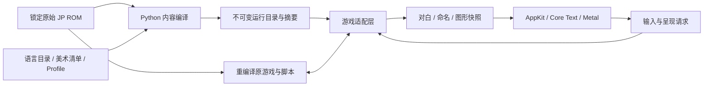

# 原生开发指南

更新：2026-09-12。本文描述当前源码和开发入口；内置功能模块的当前范围见[路线图](mod-roadmap.md)，外部包与公开 API 暂缓。所有路径相对仓库根目录。

## 当前可用范围

开发入口是 `Play SRW64 Native.command` → `tools/recomp/play_native.py --profile config/recomp/play-profile.json`。它运行锁定的原始 JP Rev 0 ROM，由原脚本驱动游戏，并接入原生显示与输入。

| 能力 | 当前实现与限制 |
| --- | --- |
| 多语言 | F7 直接热切换 `ja` / `zh-Hans`，无弹窗并记住选择；标准双框对白与新增原生 UI 已接入。中文为 153 条既有草稿，不是全游戏翻译。缺译按完整 TextKey 回退日文。 |
| Original / HD | F6 同时切换纯美术替换和 5600 模型；语言、字体、字号与分辨率不随 F6 改变。 |
| 5600 模型 | Original 保留原版八面模型；HD 按 profile 使用原生 GPU 水滴。任意模型包接口尚未开放。 |
| 阅读体验 | 四档自动、逐字、分页、回看、速度/进度和活动对话框指示；原脚本保留事件推进权。 |
| 存档恢复 | 历史 SRAM 按完成报告、ROM 身份和摘要筛选，支持列表/显式恢复；已验证第一话通关档冷启动到整备和驾驶员详情。安全节点自动保存尚未实现，见[恢复记录](native-save-recovery.md)。 |
| 姓名输入 | macOS 游戏窗口内页面、原生字段与双人确认；原字库范围与原 7/7/5 字数上限。任意 Unicode、SRAM 冷启动往返和人工 IME 候选流程未验收。 |
| 玩法 Mod | `gameplay_mods` 必须为空。机体/人物/武器 schema、关卡编辑、内容类型注册和公开 SDK 仍是计划。 |
| 平台 | 当前图形宿主为 macOS SDL2 + RT64/Metal，姓名页为 AppKit；其他平台后端未实现。 |

**退出生命周期：** 已增加游戏线程登记、协作停止、等待唤醒和完整 join，再释放 RDRAM；现代姓名→剧情关窗、原版姓名页关窗及 VI 自动退出均有最终版本验证。入口范围、系统采样缺失与剩余限制见[修复证据](native-window-close.md)。这不替代存档冷启动恢复验收。

## 源码责任与数据流

| 位置 | 当前责任 |
| --- | --- |
| `src/srw64_rom/` | 原始 ROM 身份、资源/文本格式与编解码；供 recomp、数据提取和美术工具共用。 |
| `src/srw64_native/` | 离线编译语言目录、profile、美术包和姓名头像；校验输入与输出摘要。 |
| `src/native/localization/` | C++ TextKey、目录查找、原文回退、字体和 UI 文案。 |
| `src/native/game_adapter/` | 已拆出的对白来源识别与原始姓名字形编解码。 |
| `src/native/presentation/` | 原图/HD 模式请求与 display-list 快照归属。 |
| `tools/recomp/native-host/host.cpp`、`game_hooks.*` | 原生宿主、N64 系统接入、overlay/资源钩子与 VI 控制。 |
| `native_dialogue.*`、`native_dialogue_text.cpp` | 原对白桥接、阅读状态、Core Text 排版与 Metal 合成；当前仍位于宿主目录。 |
| `native_name_entry.cpp` / `native_name_entry_macos.mm` | 游戏线程上的命名请求、原校验与写回 / 窗口线程上的字段编辑与页面绘制。 |
| `graphics.cpp`、`native_marker.cpp`、`audio.cpp` | SDL/RT64 接入、GPU 水滴绘制、音频设备适配。 |
| `window_test_control*` | 默认关闭的窗口 QA：真实 Cocoa 关窗、SDL 缩放、与 F6 相同的图片模式请求；独立于命名页面。 |
| `tools/recomp/verification_support.py` | 验证脚本共用的等待、原子请求写入和退出线程日志解析。 |
| `tools/recomp/prepare_runtime_lifecycle.py`、`runtime-support/` | 基于固定上游生成本地游戏线程/消息/调度/计时器退出适配，默认关闭系统线程诊断；生成代码与来源摘要写入 `build/`。 |

表中不带目录的宿主文件均位于 `tools/recomp/native-host/`。此轮整理没有大规模搬迁宿主；后续按游戏适配、呈现、平台责任逐步迁移，避免一次性破坏验证入口。



窗口回调提交请求，姓名字段由游戏线程在已验证时机应用。图像切换由渲染线程确认，先等已提交 workload/present 完成，再同步替换开关。对白和命名遮挡按 workload 匹配，不能用“最新一份状态”覆盖仍在呈现的旧帧。内存地址、overlay 身份和游戏写入继续属于内部适配层，尚未成为公开 ABI。

## 构建与日常检查

基础 Python 检查不需要 ROM、字体或模拟器：

```sh
make bootstrap
make check
```

原生依赖需要本机 C/C++ 工具链、CMake、Ninja、SDL2 和本地原 ROM。版本来自 `config/recomp/toolchain.json`。首次准备可参考[探针构建步骤](recomp-progress.md#可重跑入口)：

```sh
make recomp-bootstrap
make recomp-layout
make recomp-scan
make recomp-cpu
.venv/bin/python tools/recomp/prepare_rt64.py
```

`run_host_probe.py` 会复核 ROM 变体、代码兼容性、生成结果与上游版本，并按需配置/构建宿主。HD 模式要求 `content/art/stage1-hd.json` 和 `content/ui/name-entry.json` 引用的本地美术文件存在且摘要一致。新克隆请显式使用 `--images original --new-game`：Original 可在缺少 HD 素材时从原 ROM 提取原图启动，`--new-game` 不依赖开发者本地通关档。当前没有预编译发布包。

已经配置 `build/recomp/gfx-build` 后，只编译、不启动游戏：

```sh
cmake --build build/recomp/gfx-build \
  --target srw64-gfx-host srw64-frame-host srw64-coretext-frame-host -j 6
make recomp-native-check
```

`recomp-native-check` 汇集音频队列、开场控制/适配、姓名桥接、内容、Core Text 对白、计时器退出、游戏线程退出和 VI 回放测试，及随机状态探针，共 10 个测试程序。其中独立编译的 8 个程序使用 ASan/UBSan，内容/对白两个程序使用当前 CMake 配置。它不启动游戏，不替代 GPU 或整条关卡验收。需要 ROM/旧捕获的历史布局与姓名测试继续按各自文档运行。

运行时适配不直接编辑固定 N64ModernRuntime checkout，而是在 `build/recomp/runtime-lifecycle/` 生成对应源文件和 manifest。RT64 适配由 `prepare_rt64.py` 独立管理并记录来源。手写代码、配置和 manifest 规则是源码；生成的 CPU/RSP C、依赖克隆和构建日志都留在 `build/`。

## 静音验证与窗口控制

交互检查可使用新增的静音参数：

```sh
.venv/bin/python tools/recomp/play_native.py \
  --profile config/recomp/play-profile.json --new-game --mute
```

自动探针默认静音，**测试时不传 `--audio`**。完整命名流程需要两个终端，先启动宿主，再启动验证脚本；运行目录必须不存在：

```sh
SRW64_NAME_ENTRY_CONTROL=1 SRW64_WINDOW_CONTROL=1 SRW64_SHUTDOWN_TRACE=1 \
.venv/bin/python tools/recomp/run_host_probe.py \
  --graphics --profile config/recomp/play-profile.json \
  --input config/recomp/native-name-entry.json \
  --output build/recomp/qa/new-name-window --vis 9000
```

```sh
.venv/bin/python tools/recomp/verify_native_name_entry.py \
  --run build/recomp/qa/new-name-window --exit-mode window
```

改为 `--exit-mode control` 可以对照 VI 脚本退出。旧 N64 按键路线不能填写原生字段；复跑旧路线须显式使用 `--original-name-entry`。原版姓名 UI 的关窗对照可使用 `verify_window_close.py --run RUN --at-vi 1350`，同样要求 `SRW64_WINDOW_CONTROL=1`。

| 开关 / 文件 | 责任与格式 |
| --- | --- |
| `SRW64_WINDOW_CONTROL=1` / `window-close.txt` | `SRWX1 sequence at_vi`；到达 VI 后调用真实 `NSWindow.performClose`，记录 `window-close-events.jsonl`。 |
| 同一开关 / `window-control.txt` | `SRWW1 sequence width height`；窗口线程调用 SDL resize，允许 640–2560 × 480–1600。 |
| 同一开关 / `image-control.txt` | `SRWI1 sequence original或hd`；与 F6 共用请求路径。 |
| `SRW64_NAME_ENTRY_CONTROL=1` / `name-entry-control.json` | 姓名页专用字段/按钮/键盘 QA；校验打开序号、字段、递增 sequence 和活动状态。 |
| `SRW64_SHUTDOWN_TRACE=1` | macOS 下记录释放 RDRAM 前后的游戏线程数，仅诊断，不改变退出顺序。 |
| `control.txt` | `control_host.py` 提交 N64 输入/退出请求，宿主以 VI 处理并写回事件。 |

每种协议独立维护递增序号；一个运行目录只使用一个控制驱动，完整写入临时文件后原子替换。普通启动器不主动启用这些 QA 开关，开启调试用的环境变量只作用于对应测试命令。

## 结果与证据怎么读

| 产物 | 用途 |
| --- | --- |
| `RUN/report.json` | 实际宿主退出码、ROM/二进制/手写源码/依赖适配摘要、音频状态、输入与保存来源。 |
| `RUN.native.log` | 与 RUN 同级的宿主日志；窗口退出事件、诊断和错误。 |
| `RUN/live-state.json`、`control-events.jsonl` | 当前 VI、输入请求是否已应用。 |
| `RUN/name-entry-acceptance.json`、`names-readback.json` | UI 流程结果及进入剧情后的原游戏姓名内存字段。 |
| `RUN/page-*-window.png` | 实际 macOS 游戏窗口；姓名页自身缓存图不能替代最终外观。 |
| `RUN/present-*.png/json`、`dialogue-raster.json` | 已完成 GPU 帧及其模式/尺寸、对应原生文字排版。 |
| `RUN/runtime-data/saves/` | 本次隔离运行的 SRAM；正常试玩历史在 `build/recomp/profile-play/sessions/`。 |

交互试玩默认 `light`，不做周期性 GPU/8 MiB RAM 导出；有界探针默认 `full`。运行结果缺少截图时先确认诊断模式。诊断线程列表为空表示未观察到该边界，不等于线程数为零。

`run_host_probe.py` 的 CLI 状态反映该探针是否达到要求：提前真实关窗可能返回 1，而 `report.json.exit_code` 仍为 0。二者都不能证明线程生命周期安全；命名验证现在明确记录 `shutdown_lifecycle_verified: false`，并单列诊断观测值。

## 测试结束与工作区整理

结束仍在运行的测试时，优先关闭其游戏窗口，或对已确认的运行目录执行：

```sh
.venv/bin/python tools/recomp/control_host.py RUN --quit
```

等待 `report.json` 和进程结束。若进程卡住，先检查 PID 的命令、父进程和工作目录，再只终止确认属于本次测试的 PID，并保留超时/异常日志。不要使用 `killall Python`、`killall node` 或按整个工作区路径杀进程；Codex 工具也可能以此为工作目录。

`active.lock` 是 `flock` 文件，文件存在不等于仍有进程持锁。不要靠删锁文件解决运行中的冲突。验证目录、截图、来源 manifest 和 SRAM 都有追溯价值，不进行宽泛的 `git clean` 或清空 `build/`。源码目录的 `__pycache__` / `.pyc` 可在检查完成后删除；editable Python 安装产生的 `egg-info` 是本地安装元数据，保持忽略即可。

本轮整理的检查与清理结果记录在本地 `build/recomp/cleanup-check/`；历史退出缺陷证据继续保留在 `build/recomp/window-close-check/`。
