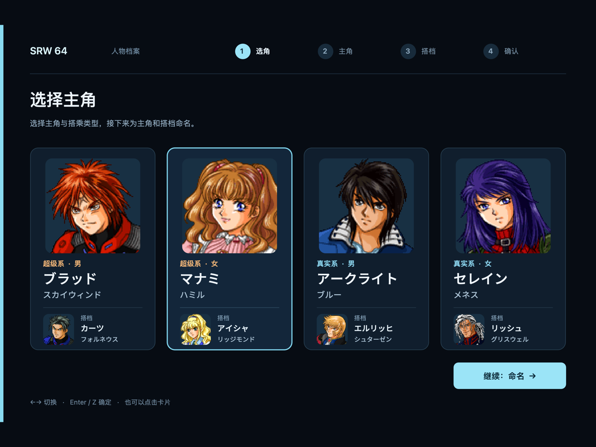

# 原生姓名输入

2026-09-11（2026-09-18 加入主角选择页）。统一 JP 基线的原生入口已接管开场的主角选择，以及主角、搭档的姓名编辑。现代姓名页面是共享的 SDL／RmlUi 页面，直接画在游戏窗口里，替换选字表及最终确认 UI，不开子窗口（2026-09-22 起不再用 AppKit）。三个输入框同时显示名字、姓氏和昵称，左栏显示人物头像与实时姓名预览。输入法组字走 SDL 的文本编辑事件；确认输入法候选不会同时确认游戏姓名。

## 使用

重新启动 `scripts/Play SRW64 Native.command`，选择新游戏、跳过公共序章后先出现主角选择页，确定后进入姓名页面。选择、主角、搭档、确认四步采用同一套页头；支持 `ja` 和 `zh-Hans` UI 文案。页面在 Original 和 HD 模式下均可用，人物头像按模式选取原图或已登记的 HD 图。

- **主角选择**：四张卡片按原版顺序并排——ブラッド（超级系·男）、マナミ（超级系·女）、アークライト（真实系·男）、セレイン（真实系·女），每张上方是主角头像、搭乘类型与性别和默认姓名，分隔线下单独一行是搭档头像与姓名，两张头像互不遮挡。←→（↑↓）切换，Enter／Z／空格确定；鼠标点击卡片高亮，再点一次或双击即确定，也可以按“继续：命名”。切换时播放原版的光标音，确定时播放原版确认音。原版这一页没有返回，这一页也没有。
- 默认值预填并选中，可以直接键入或粘贴；点击字段或 Tab / Shift-Tab 切换，Enter 下一项，最后一项提交。底部“继续”也可以一次校验并提交三个字段。
- “恢复默认”恢复当前人物打开页面时的三个值。
- 双人确认页显示两人的名字、姓氏和昵称；“修改姓名”返回主角页，“开始故事”沿原版入口进入剧情。
- 窗口缩放时头像、文字、输入框和按钮按同一个布局比例缩放，不另开窗口。SDL 提前更新 Metal layer 时也同步 Plume drawable 描述尺寸，避免返回剧情后对白仍使用上一次窗口尺寸。
- “返回角色选择”／Esc 放弃该人物本轮未确认的编辑，回到原版角色选择。
- 名字、姓氏各最多 7 字，昵称最多 5 字。不支持的字符、空输入、首尾空格或超长输入会显示错误，不能提交。
- 原版禁用姓名规则继续生效；主角和搭档不能使用相同的全名。校验失败会回滚原版姓名区，避免一部分新名字已经写入、一部分仍是旧值。

这一版接受原 ROM 已有且已解码的字形，包括假名、英文字母、数字和已有汉字。例如可以直接输入原选字键盘没有列出的“光”。它没有把 Unicode 码点当作游戏字形编号，也没有通过外部 JSON 偷换显示名。原版字体以外的任意中文／Unicode 名字及其存档扩展仍需后续实现。

## 适配边界

**可关**（2026-09-23）：设置页「主角选择・名前入力」选原版（`presentation.json` 的 `name_entry_ui`，调试接口 `settings {"name_entry_ui": "original"}`），下一次新游戏进入主角选择时起用原版页面；`SRW64_NATIVE_NAME_ENTRY=0` 整次运行保留原版。验证脚本 `tools/recomp/debug/check_name_entry_ui_switch.py`（2026-09-23，`build/recomp/debug/20260923T045705.937081Z/`，3 项通过：标题画面设为原版后开新游戏，按过序章出现原版 シナリオ選択 页而非原生页，`name-entry-original.png`；设回新版时 `presentation-settings.json` 写 `name_entry_ui`）。

手写桥接代码在 `src/host/native_name_entry.cpp`，原生 UI 在 `src/native/ui/name_page.cpp`（RmlUi），字符编码与虚拟文字记录在 `src/native/game_adapter/name_codec.hpp`。平台 UI 只接收不可变请求和提交草稿；只有游戏线程读取、修改 RDRAM，UI 线程不调用原版函数。新增 UI 标签在 `content/locales/{ja,zh-Hans}.json`，沿用日文回退机制。

拦截 ROM `0x1090A0` 的 `801C5004/801C50B8`（主角选择）、`801C5494/801C5644`（主角）、`801C5920/801C5AD0`（搭档）、`801C5DAC/801C5E88`（最终确认）。初始化后立即盖住原选字表，原淡入结束后才允许提交；确认时调用原校验函数 `801C474C`。确认页完成后写入原退出标志并调用原淡出，剧情入口及姓名存储仍走原游戏逻辑。机器人改名不在此次 UI 改造范围内。

**主角选择页**（2026-09-18）：原版 `801C50B8` 在浏览状态用左右键（`801C34E4`）在 `801C70FA` 里循环 0–3，A 打开「はい／いいえ」，「はい」时若路线与上次确认的（`801C70B0`）不同，就把两份姓名区各 30 字填成 `0x1549` 并调用 `801C3744` 载入该路线的默认姓名，然后状态字 `801C6FB0` 置 1、记下路线、调用淡出 `80099814(5,1,2)`；原版没有返回键。原生页确定时在游戏线程上按同样顺序执行（含 `8007E8A8` 的 0xB7 确认音），不经过「はい／いいえ」；浏览时每步播放一次 0xB9 光标音。卡片上的默认姓名从 `801C3744` 用的同一组表读取：名字 `801C6C00`、姓氏 `801C6C70`，每条路线 7 个码，搭档在 +0x38，末尾以 0xCA（即 `0x1549`）补齐；每个码是选字表里的一个字，对应文本 0 表 id `0x147F + 码` 的一个字形。解码失败（出现名字编码器不认识的字形）时保留原版页面。`tests/test_protagonist_select.py` 对照 ROM 校验八个默认姓名与「はい」路径的关键指令，`tests/native_name_entry.cpp` 覆盖选择、确认、路线未变时不重置姓名等行为。

2026-09-18 用[调试接口](../guide/debug-interface.md)实测：新游戏跳过公共序章后出现选择页，`status.name_page` 列出四条路线的默认姓名；`uikey right` 高亮 1；点击「セレイン・メネス」高亮 3，再点一次确定，姓名页预填セレイン／メネス／セレイン（路线 3 的默认值由原版 `801C3744` 载入）；「返回角色选择」回到选择页并保持高亮 3，Enter 再次确定、姓名不被重置；退出码 0。第一次实测发现卡片从键盘或 `performClick:` 触发时读 `NSEvent.clickCount` 会抛异常，已改为只在鼠标事件上读取。

窗口缩放另修复了固定 Plume 版本的尺寸同步：SDL 可能先更新 `CAMetalLayer.drawableSize`，原 `MetalSwapChain::resize` 在尺寸已相同时跳过了 drawable 描述更新，导致后续 framebuffer 与原生对白仍按旧尺寸绘制。`prepare_rt64.py` 的受控补丁将描述更新移到该条件之外，保留依赖版本锁和前后 SHA-256 检查。实机检查新增返回剧情后 `dialogue-raster.json` 尺寸与窗口一致的断言。

`Request.visible` 与 `active` 分开：人物间过渡、重新编辑和退出等待期间保留页面。每个 RT64 workload 记录是否应遮盖选字表，Metal 末尾清除相应底图；场景失效按代码地址区间重叠判断（后续序章从 `801C4500` 装载），AppKit 覆盖层在退出帧完成后才移除。测试截图应使用真实游戏窗口截图，GPU 读回单独只会包含命名底色，不能当作输入 UI 的视觉证据。

`src/srw64_native/name_assets.py` 从原 ROM 的角色路线表和 face 资源表提取八张原版头像，`content/ui/name-entry.json` 登记可选 HD 资源及 SHA-256。当前 HD 替换包括已审核的マナミ头像，其余角色自动使用原头像。后续添加资源只需扩充该映射；没有为未提供的角色生成新图。

| 字段 | 主角地址 | 搭档地址 |
| --- | --- | --- |
| 名字 | `8010F5F8` | `8010F608` |
| 姓氏 | `8010F618` | `8010F628` |
| 昵称 | `8010F638` | `8010F644` |
| 全名 | `8010F650` | `8010F674` |

全名继续用原版 `0x00E7` 中点连接，字符串继续以 `0xFFFF` 终止。原版编辑器的模板另存 TEXT ID，不能填字形编号；因此用 `E000..E81E` 的虚拟单字记录支持返回重改，虚拟 ROM 区起于 `0x02400000`。原姓名字段内仍然只保存真实原版字形。它与旧 stage1 补丁 `NativeNames` 的 `FFE0..FFE4` 区间独立。

编辑期间屏蔽全部游戏按键和摇杆，也屏蔽游戏 Esc 退出和 F6 切图。离开姓名页面后等待相关物理按键释放，再恢复游戏输入，防止 Enter、方向键和输入中的 Z/X 穿透。这个物理释放检查属于 macOS 平台层，每次关闭页面只等一次，且只在游戏窗口有焦点时计入按键。2026-09-18 修正：此前检查在关闭后每帧持续进行，此后任何按住的游戏键（E+Z 快进、I/K 字号、Q 回看、路线序章的 E+Enter 跳过）都会被当作“仍在释放”而挡掉；它读取的是系统级键盘状态，在其他应用里打字也会挡住游戏输入。

## 验证与证据

现在的页面用[调试接口](../guide/debug-interface.md)驱动：`ui.click`、`ui.type`（`marked`／`unmark` 模拟输入法组字与提交）和 `ui.key` 操作字段与按钮，`status.name_page` 给出当前请求与各字段的值。
- `tools/recomp/debug/check_name_entry_ui_switch.py`：检查原版／现代页面切换。
- `tools/recomp/debug/check_dialogue.py`：新游戏时用 Enter 走完主角选择与命名，进入剧情。

组件检查：`make recomp-name-entry-test`，ASan＋UBSan 覆盖字符/长度校验、原版校验失败后的完整回滚、过场时机、取消、虚拟 TEXT DMA、边界检查、陈旧请求拒绝、按键消费和 guest 寄存器保留。另已通过 `make check`、`make recomp-content-test`。

**历史记录（2026-09-11 至 09-18 的 AppKit 版）**：
- 当时由 `SRW64_NAME_ENTRY_CONTROL` 控制文件和 verify_native_name_entry.py 驱动；这两样随 AppKit 页面一起删除。
- 那一版检查过：无子窗口、嵌入字段、Tab 与 Shift-Tab、800×600 / 1200×800 缩放、无效输入与原版重名拒绝、取消返回、双人确认页重新编辑、两个角色的八个姓名字段，以及自定义昵称“ヒカリ”进入剧情。
- 运行目录：
  - `build/recomp/cleanup-check/name-window/`：完整命名、八字段写回、进入剧情、缩放和真实关窗通过，退出码 0；
  - `build/recomp/window-close-check/{window-1,control-trace,window-trace}/`：三轮通过，退出生命周期缺陷见[退出验证](native-window-close.md)；
  - `build/recomp/name-page/live-4/`（中文 HD）、`ja-original/`（日文 Original）、`final-hd/`（渲染尺寸补丁后，VI 2855 关窗时宿主退出崩溃，`final-review.json` 分开记录）；
  - 旧弹窗实现在 `build/recomp/name-input/runtime-2/`。
- 这些都不代表现在的页面外观。
- 当时的自动测试是往 `NSTextView` 插入文字，不等于人工操作输入法候选框。
- 游戏内保存后冷启动重读仍未执行：原始姓名内存字段与剧情使用已证明，SRAM 往返尚不标为通过。原版字体以外的任意 Unicode 姓名不属于这一版支持范围。

旧的 N64 按键脚本通过移动选字格确认姓名，无法操作新的原生姓名页面。复现旧基线时给 `run_host_probe.py` 加 `--original-name-entry`，模式会记录进报告。CPU-only、固定帧回放和旧 stage1 补丁运行继续保持原版输入器。
